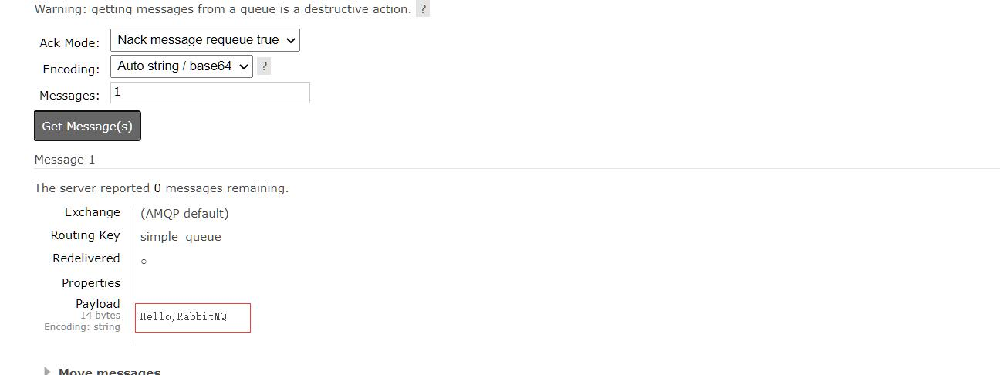

# 相关文章

https://blog.csdn.net/u013256816/category_6532725.html

# 1.为什么使用MQ

异步,解耦,削峰

# 2.安装rabbitmq

## 2.1.docker安装

```shell
#1.拉去dockers镜像
[root@pinyoyougou-docker ~]# docker pull rabbitmq:management

#2.创建容器
docker run -di --name=myrabbitmq \
-p 5671:5671 -p 5672:5672 -p 4369:4369 -p 15671:15671 -p 15672:15672 -p 25672:25672 \
rabbitmq:management

#3.端口说明 
#rabbitmq需要有映射以下端口: 5671 5672 4369 15671 15672
#  15672 (if management plugin is enabled)
#  15671 management监听端口
#  5672, 5671 (AMQP 0-9-1 without and with TLS)
#  4369 (epmd) epmd  代表 Erlang 端口映射守护进程
#  25672 (Erlang distribution)

#4.浏览器访问 http://192.168.184.134:15672 guest guest
```

## 2.2windows安装


## 2.3cenos安装

# 3. 配置虚拟主机及用户

## 3.1. 用户角色

RabbitMQ在安装好后,可以访问`http://ip地址:15672` .其自带了guest/guest的用户名和密码.如果需要创建自定义用户,那么也可以登录管理界面后,如下操作：

 


**角色说明**：

> - 1、 超级管理员(administrator)
>   - 可登陆管理控制台,可查看所有的信息,并且可以对用户,策略(policy)进行操作。
> - 2、 监控者(monitoring)
>   - 可登陆管理控制台,同时可以查看rabbitmq节点的相关信息(进程数,内存使用情况,磁盘使用情况等)
> - 3、 策略制定者(policymaker)
>   - 可登陆管理控制台, 同时可以对policy进行管理。但无法查看节点的相关信息(上图红框标识的部分)。
> - 4、 普通管理者(management)
>   - 仅可登陆管理控制台，无法看到节点信息，也无法对策略进行管理。
> - 5、 其他
>   - 无法登陆管理控制台，通常就是普通的生产者和消费者。

## 3.2. Virtual Hosts配置

> - 像mysql拥有数据库的概念并且可以指定用户对库和表等操作的权限。
> - RabbitMQ也有类似的权限管理。
> - 在RabbitMQ中可以虚拟消息服务器Virtual Host,每个Virtual Hosts相当于一个相对独立的RabbitMQ服务器,每个VirtualHost之间是相互隔离的。exchange、queue、message不能互通。 
> - 相当于mysql的db。
> - Virtual Name一般以/开头。

### 3.2.1. 创建Virtual Hosts


### 3.2.2. 设置Virtual Hosts权限


# 4. RabbitMQ入门 -简单模式

## 4.1. 搭建示例工程

## 4.1.1.创建工程 添加依赖

```java
<dependency>
    <groupId>com.rabbitmq</groupId>
    <artifactId>amqp-client</artifactId>
    <version>5.6.0</version>
</dependency>
```

## 4.1.2. 编写生产者

```java
package com.itheima.rabbitmq.simple;

import com.rabbitmq.client.Channel;
import com.rabbitmq.client.Connection;
import com.rabbitmq.client.ConnectionFactory;
/**
 * 简单模式-生产者
 */
public class Producer {

    static final String QUEUE_NAME = "simple_queue";

    public static void main(String[] args) throws Exception {
        //创建连接工厂
        ConnectionFactory connectionFactory = new ConnectionFactory();
        //主机地址;默认为 localhost
        connectionFactory.setHost("localhost");
        //连接端口;默认为 5672
        connectionFactory.setPort(5672);
        //虚拟主机名称;默认为 /
        connectionFactory.setVirtualHost("/itcast");
        //连接用户名；默认为guest
        connectionFactory.setUsername("heima");
        //连接密码；默认为guest
        connectionFactory.setPassword("heima");

        //创建连接
        Connection connection = connectionFactory.newConnection();

        // 创建频道
        Channel channel = connection.createChannel();

        // 声明（创建）队列
        /**
         * 参数1：队列名称
         * 参数2：是否定义持久化队列
         * 参数3：是否独占本次连接
         * 参数4：是否在不使用的时候自动删除队列
         * 参数5：队列其它参数
         */
        channel.queueDeclare(QUEUE_NAME, true, false, false, null);

        // 要发送的信息
        String message = "你好；小兔子！";
        /**
         * 参数1：交换机名称，如果没有指定则使用默认Default Exchage
         * 参数2：路由key,简单模式可以传递队列名称
         * 参数3：消息其它属性
         * 参数4：消息内容
         */
        channel.basicPublish("", QUEUE_NAME, null, message.getBytes());
        System.out.println("已发送消息：" + message);

        // 关闭资源
        channel.close();
        connection.close();
    }
}

```

## 4.1.3.查看




## 4.1.4. 编写消费者

抽取创建connection的工具类com.itheima.rabbitmq.util.ConnectionUtil；

```
import com.rabbitmq.client.Connection;
import com.rabbitmq.client.ConnectionFactory;
/**
 * 简单模式-消费者
 */
public class ConnectionUtil {

    public static Connection getConnection() throws Exception {
        //创建连接工厂
        ConnectionFactory connectionFactory = new ConnectionFactory();
        //主机地址;默认为 localhost
        connectionFactory.setHost("localhost");
        //连接端口;默认为 5672
        connectionFactory.setPort(5672);
        //虚拟主机名称;默认为 /
        connectionFactory.setVirtualHost("/itcast");
        //连接用户名；默认为guest
        connectionFactory.setUsername("heima");
        //连接密码；默认为guest
        connectionFactory.setPassword("heima");

        //创建连接
        return connectionFactory.newConnection();
    }

}

```

编写消息的消费者simple.Consumer

```java
import com.itheima.rabbitmq.util.ConnectionUtil;
import com.rabbitmq.client.*;

import java.io.IOException;

public class Consumer {

    public static void main(String[] args) throws Exception {
        Connection connection = ConnectionUtil.getConnection();

        // 创建频道
        Channel channel = connection.createChannel();

        // 声明（创建）队列
        /**
         * 参数1：队列名称
         * 参数2：是否定义持久化队列
         * 参数3：是否独占本次连接
         * 参数4：是否在不使用的时候自动删除队列
         * 参数5：队列其它参数
         */
        channel.queueDeclare(Producer.QUEUE_NAME, true, false, false, null);

        //创建消费者；并设置消息处理
        DefaultConsumer consumer = new DefaultConsumer(channel){
            @Override
            /**
             * consumerTag 消息者标签，在channel.basicConsume时候可以指定
             * envelope 消息包的内容，可从中获取消息id，消息routingkey，交换机，消息和重传标志(收到消息失败后是否需要重新发送)
             * properties 属性信息
             * body 消息
             */
            public void handleDelivery(String consumerTag, Envelope envelope, AMQP.BasicProperties properties, byte[] body) throws IOException {
                //路由key
                System.out.println("路由key为：" + envelope.getRoutingKey());
                //交换机
                System.out.println("交换机为：" + envelope.getExchange());
                //消息id
                System.out.println("消息id为：" + envelope.getDeliveryTag());
                //收到的消息
                System.out.println("接收到的消息为：" + new String(body, "utf-8"));
            }
        };
        //监听消息
        /**
         * 参数1：队列名称
         * 参数2：是否自动确认，设置为true为表示消息接收到自动向mq回复接收到了，mq接收到回复会删除消息，设置为false则需要手动确认
         * 参数3：消息接收到后回调
         */
        channel.basicConsume(Producer.QUEUE_NAME, true, consumer);

        //不关闭资源，应该一直监听消息
        //channel.close();
        //connection.close();
    }
}
```

#  5. Work queues工作队列模式

## 5.1. 模式说明

> - 与简单模式相比,工作队列模式多了一些消费端。
> - 多个消费端,共同共同消费同一个队列中的消息。
> - 对于任务过重或任务较多情况使用工作队列可以提高任务处理的速度。
> - 在一个队列中如果有多个消费者，那么消费者之间对于同一个消息的关系是竞争的关系。

## 5.2.生产者

```java
import com.agzy.rabbitmq.quick.utils.ConnectionUtil;
import com.rabbitmq.client.Channel;
import com.rabbitmq.client.Connection;

/**
 * 工作队列模式-生产者
 * 简述:与简单模式相比,多了一些消费端,多个消费端,共同共同消费同一个队列中的消息
 *     对于任务过重或任务较多情况使用工作队列可以提高任务处理的速度。
 *     在一个队列中如果有多个消费者，那么消费者之间对于同一个消息的关系是竞争的关系。
 */
public class Producer {

    static final String QUEUE_NAME = "work_queue";

    public static void main(String[] args) throws Exception {

        //创建连接
        Connection connection = ConnectionUtil.getConnection();

        // 创建频道
        Channel channel = connection.createChannel();

        // 声明（创建）队列
        /**
         * 参数1：队列名称
         * 参数2：是否定义持久化队列
         * 参数3：是否独占本次连接
         * 参数4：是否在不使用的时候自动删除队列
         * 参数5：队列其它参数
         */
        channel.queueDeclare(QUEUE_NAME, true, false, false, null);

        for (int i = 1; i <= 30; i++) {
            // 发送信息
            String message = "你好；小兔子！work模式--" + i;
            /**
             * 参数1：交换机名称，如果没有指定则使用默认Default Exchage
             * 参数2：路由key,简单模式可以传递队列名称
             * 参数3：消息其它属性
             * 参数4：消息内容
             */
            channel.basicPublish("", QUEUE_NAME, null, message.getBytes());
            System.out.println("已发送消息：" + message);
        }

        // 关闭资源
        channel.close();
        connection.close();
    }
}
```

## 5.3.消费者1

```java
import com.agzy.rabbitmq.quick.utils.ConnectionUtil;
import com.rabbitmq.client.*;

import java.io.IOException;

public class Consumer1 {

    public static void main(String[] args) throws Exception {
        Connection connection = ConnectionUtil.getConnection();

        // 创建频道
        Channel channel = connection.createChannel();

        // 声明（创建）队列
        /**
         * 参数1：队列名称
         * 参数2：是否定义持久化队列
         * 参数3：是否独占本次连接
         * 参数4：是否在不使用的时候自动删除队列
         * 参数5：队列其它参数
         */
        channel.queueDeclare(Producer.QUEUE_NAME, true, false, false, null);

        //一次只能接收并处理一个消息
        channel.basicQos(1);

        //创建消费者；并设置消息处理
        DefaultConsumer consumer = new DefaultConsumer(channel){
            @Override
            /**
             * consumerTag 消息者标签，在channel.basicConsume时候可以指定
             * envelope 消息包的内容，可从中获取消息id，消息routingkey，交换机，消息和重传标志(收到消息失败后是否需要重新发送)
             * properties 属性信息
             * body 消息
             */
            public void handleDelivery(String consumerTag, Envelope envelope, AMQP.BasicProperties properties, byte[] body) throws IOException {
                try {
                    //路由key
                    System.out.println("路由key为：" + envelope.getRoutingKey());
                    //交换机
                    System.out.println("交换机为：" + envelope.getExchange());
                    //消息id
                    System.out.println("消息id为：" + envelope.getDeliveryTag());
                    //收到的消息
                    System.out.println("消费者1-接收到的消息为：" + new String(body, "utf-8"));
                    Thread.sleep(1000);

                    //确认消息
                    channel.basicAck(envelope.getDeliveryTag(), false);
                } catch (InterruptedException e) {
                    e.printStackTrace();
                }
            }
        };
        //监听消息
        /**
         * 参数1：队列名称
         * 参数2：是否自动确认，设置为true为表示消息接收到自动向mq回复接收到了，mq接收到回复会删除消息，设置为false则需要手动确认
         * 参数3：消息接收到后回调
         */
        channel.basicConsume(Producer.QUEUE_NAME, false, consumer);
    }
}
```

## 5.4.消费者2

```java
import com.agzy.rabbitmq.quick.utils.ConnectionUtil;
import com.rabbitmq.client.*;

import java.io.IOException;

public class Consumer2 {

    public static void main(String[] args) throws Exception {
        Connection connection = ConnectionUtil.getConnection();

        // 创建频道
        Channel channel = connection.createChannel();

        // 声明（创建）队列
        /**
         * 参数1：队列名称
         * 参数2：是否定义持久化队列
         * 参数3：是否独占本次连接
         * 参数4：是否在不使用的时候自动删除队列
         * 参数5：队列其它参数
         */
        channel.queueDeclare(Producer.QUEUE_NAME, true, false, false, null);

        //一次只能接收并处理一个消息
        channel.basicQos(1);

        //创建消费者；并设置消息处理
        DefaultConsumer consumer = new DefaultConsumer(channel){
            @Override
            /**
             * consumerTag 消息者标签，在channel.basicConsume时候可以指定
             * envelope 消息包的内容，可从中获取消息id，消息routingkey，交换机，消息和重传标志(收到消息失败后是否需要重新发送)
             * properties 属性信息
             * body 消息
             */
            public void handleDelivery(String consumerTag, Envelope envelope, AMQP.BasicProperties properties, byte[] body) throws IOException {
                try {
                    //路由key
                    System.out.println("路由key为：" + envelope.getRoutingKey());
                    //交换机
                    System.out.println("交换机为：" + envelope.getExchange());
                    //消息id
                    System.out.println("消息id为：" + envelope.getDeliveryTag());
                    //收到的消息
                    System.out.println("消费者2-接收到的消息为：" + new String(body, "utf-8"));
                    Thread.sleep(1000);

                    //确认消息
                    channel.basicAck(envelope.getDeliveryTag(), false);
                } catch (InterruptedException e) {
                    e.printStackTrace();
                }
            }
        };
        //监听消息
        /**
         * 参数1：队列名称
         * 参数2：是否自动确认，设置为true为表示消息接收到自动向mq回复接收到了，mq接收到回复会删除消息，设置为false则需要手动确认
         * 参数3：消息接收到后回调
         */
        channel.basicConsume(Producer.QUEUE_NAME, false, consumer);
    }
}
```


# 6. 订阅模式类型

订阅模式示例图：


> 简单模式和工作队列模式中，只有3个角色：
>
> - [ ] P：生产者，也就是要发送消息的程序
> - [ ] C：消费者：消息的接受者，会一直等待消息到来。
> - [ ] queue：消息队列，图中红色部分

------

> 而在订阅模型中，多了一个exchange角色，而且过程略有变化：
>
> - [ ] P：生产者，也就是要发送消息的程序，但是不再发送到队列中，而是发给X（交换机）
>
> - [ ] C：消费者，消息的接受者，会一直等待消息到来。
>
> - [ ] Queue：消息队列，接收消息、缓存消息。
>
> - [ ] Exchange：交换机，图中的X。一方面，接收生产者发送的消息。另一方面，知道如何处理消息，例如递交给某个特别队列、递交给所有队列、或是将消息丢弃。到底如何操作，取决于Exchange的类型。Exchange有常见以下3种类型：    
>
>   - [ ] Fanout：广播，将消息交给所有绑定到交换机的队列 `Publish/Subscribe发布与订阅模式`
>
>   - [ ] Direct：定向，把消息交给符合指定routing key 的队列  `Routing路由模式`
>
>   - [ ] Topic：通配符，把消息交给符合routing pattern（路由模式） 的队列 `Topics通配符模式`

------

`Exchange（交换机）只负责转发消息，不具备存储消息的能力`，因此如果没有任何队列与Exchange绑定，或者没有符合路由规则的队列，那么消息会丢失！  

# 7.订阅模式之-Publish/Subscribe发布与订阅模式


------

> 1.发布订阅模式 **广播**
>
> - [ ] 每个消费者监听自己的队列。   
> - [ ] 生产者将消息发给broker,由交换机将消息转发到绑定此交换机的每个队列,每个绑定交换机的队列都将接收到消息 。
> - [ ] 广播(redis也有广播)每一个监听的队列都能收到消息
> - [ ] 交换机需要与队列进行绑定,绑定之后;一个消息可以被多个消费者都收到。
>
> 2.发布订阅模式与工作队列模式的区别
>
> - [ ] 工作队列模式不用定义交换机,而发布/订阅模式需要定义交换机。 
> - [ ] 发布/订阅模式的生产方是面向交换机发送消息,工作队列模式的生产方是面向队列发送消息(底层使用默认交换机)。
> - [ ] 发布/订阅模式需要设置队列和交换机的绑定,工作队列模式不需要设置,实际上工作队列模式会将队列绑定到默认的交换机 。

## 7.1.案例

### 7.7.1生产者

```java
/**
 * Publish/Subscribe发布与订阅模式-生产者
 * 发布与订阅使用的交换机类型为：fanout
 */
public class Producer {

    //交换机名称
    static final String FANOUT_EXCHAGE = "fanout_exchange";
    //队列名称
    static final String FANOUT_QUEUE_1 = "fanout_queue_1";
    //队列名称
    static final String FANOUT_QUEUE_2 = "fanout_queue_2";

    public static void main(String[] args) throws Exception {

        //创建连接
        Connection connection = ConnectionUtil.getConnection();

        // 创建频道
        Channel channel = connection.createChannel();

        /**
         * 声明交换机
         * 参数1：交换机名称
         * 参数2：交换机类型，fanout、topic、direct、headers
         */
        channel.exchangeDeclare(FANOUT_EXCHAGE, BuiltinExchangeType.FANOUT);

        // 声明（创建）队列
        /**
         * 参数1：队列名称
         * 参数2：是否定义持久化队列
         * 参数3：是否独占本次连接
         * 参数4：是否在不使用的时候自动删除队列
         * 参数5：队列其它参数
         */
        channel.queueDeclare(FANOUT_QUEUE_1, true, false, false, null);
        channel.queueDeclare(FANOUT_QUEUE_2, true, false, false, null);

        //队列绑定交换机
        channel.queueBind(FANOUT_QUEUE_1, FANOUT_EXCHAGE, "");
        channel.queueBind(FANOUT_QUEUE_2, FANOUT_EXCHAGE, "");

        for (int i = 1; i <= 10; i++) {
            // 发送信息
            String message = "你好；小兔子！发布订阅模式--" + i;
            /**
             * 参数1：交换机名称，如果没有指定则使用默认Default Exchage
             * 参数2：路由key,简单模式可以传递队列名称
             * 参数3：消息其它属性
             * 参数4：消息内容
             */
            channel.basicPublish(FANOUT_EXCHAGE, "", null, message.getBytes());
            System.out.println("已发送消息：" + message);
        }

        // 关闭资源
        channel.close();
        connection.close();
    }
}
```

### 7.7.2.消费者1

```java
import com.agzy.rabbitmq.quick.utils.ConnectionUtil;
import com.rabbitmq.client.*;

import java.io.IOException;

/**
 * Publish/Subscribe发布与订阅模式-消费者
 */
public class Consumer1 {

    public static void main(String[] args) throws Exception {
        Connection connection = ConnectionUtil.getConnection();

        // 创建频道
        Channel channel = connection.createChannel();

        //声明交换机
        channel.exchangeDeclare(Producer.FANOUT_EXCHAGE, BuiltinExchangeType.FANOUT);

        // 声明（创建）队列
        /**
         * 参数1：队列名称
         * 参数2：是否定义持久化队列
         * 参数3：是否独占本次连接
         * 参数4：是否在不使用的时候自动删除队列
         * 参数5：队列其它参数
         */
        channel.queueDeclare(Producer.FANOUT_QUEUE_1, true, false, false, null);

        //队列绑定交换机
        channel.queueBind(Producer.FANOUT_QUEUE_1, Producer.FANOUT_EXCHAGE, "");

        //创建消费者；并设置消息处理
        DefaultConsumer consumer = new DefaultConsumer(channel){
            @Override
            /**
             * consumerTag 消息者标签，在channel.basicConsume时候可以指定
             * envelope 消息包的内容，可从中获取消息id，消息routingkey，交换机，消息和重传标志(收到消息失败后是否需要重新发送)
             * properties 属性信息
             * body 消息
             */
            public void handleDelivery(String consumerTag, Envelope envelope, AMQP.BasicProperties properties, byte[] body) throws IOException {
                //路由key
                System.out.println("路由key为：" + envelope.getRoutingKey());
                //交换机
                System.out.println("交换机为：" + envelope.getExchange());
                //消息id
                System.out.println("消息id为：" + envelope.getDeliveryTag());
                //收到的消息
                System.out.println("消费者1-接收到的消息为：" + new String(body, "utf-8"));
            }
        };
        //监听消息
        /**
         * 参数1：队列名称
         * 参数2：是否自动确认，设置为true为表示消息接收到自动向mq回复接收到了，mq接收到回复会删除消息，设置为false则需要手动确认
         * 参数3：消息接收到后回调
         */
        channel.basicConsume(Producer.FANOUT_QUEUE_1, true, consumer);
    }
}
```

### 7.7.3.消费者2

```java
import com.agzy.rabbitmq.quick.utils.ConnectionUtil;
import com.rabbitmq.client.*;

import java.io.IOException;
/**
 * Publish/Subscribe发布与订阅模式-消费者
 */
public class Consumer2 {

    public static void main(String[] args) throws Exception {
        Connection connection = ConnectionUtil.getConnection();

        // 创建频道
        Channel channel = connection.createChannel();

        //声明交换机
        channel.exchangeDeclare(Producer.FANOUT_EXCHAGE, BuiltinExchangeType.FANOUT);

        // 声明（创建）队列
        /**
         * 参数1：队列名称
         * 参数2：是否定义持久化队列
         * 参数3：是否独占本次连接
         * 参数4：是否在不使用的时候自动删除队列
         * 参数5：队列其它参数
         */
        channel.queueDeclare(Producer.FANOUT_QUEUE_2, true, false, false, null);

        //队列绑定交换机
        channel.queueBind(Producer.FANOUT_QUEUE_2, Producer.FANOUT_EXCHAGE, "");

        //创建消费者；并设置消息处理
        DefaultConsumer consumer = new DefaultConsumer(channel){
            @Override
            /**
             * consumerTag 消息者标签，在channel.basicConsume时候可以指定
             * envelope 消息包的内容，可从中获取消息id，消息routingkey，交换机，消息和重传标志(收到消息失败后是否需要重新发送)
             * properties 属性信息
             * body 消息
             */
            public void handleDelivery(String consumerTag, Envelope envelope, AMQP.BasicProperties properties, byte[] body) throws IOException {
                //路由key
                System.out.println("路由key为：" + envelope.getRoutingKey());
                //交换机
                System.out.println("交换机为：" + envelope.getExchange());
                //消息id
                System.out.println("消息id为：" + envelope.getDeliveryTag());
                //收到的消息
                System.out.println("消费者2-接收到的消息为：" + new String(body, "utf-8"));
            }
        };
        //监听消息
        /**
         * 参数1：队列名称
         * 参数2：是否自动确认，设置为true为表示消息接收到自动向mq回复接收到了，mq接收到回复会删除消息，设置为false则需要手动确认
         * 参数3：消息接收到后回调
         */
        channel.basicConsume(Producer.FANOUT_QUEUE_2, true, consumer);
    }
}
```

### 7.7.4.测试


------


## 7.2. 订阅模式之-Routing路由模式

### 7.2.1. 模式说明

> 路由模式特点：**按需接收**
>
> - 队列与交换机的绑定，不能是任意绑定了，而是要指定一个`RoutingKey`（路由key）
> - 消息的发送方在向Exchange发送消息时,也必须指定消息的 `RoutingKey`。
> - Exchange不再把消息交给每一个绑定的队列,而是根据消息的`RoutingKey`进行判断,只有队列的`Routingkey`与消息的 `Routing key`完全一致，才会接收到消息
> - Routing模式要求队列在绑定交换机时要指定routingKey，消息会转发到符合routingKey的队列


> 图解：
>
> - P：生产者，向Exchange发送消息，发送消息时，会指定一个routing key。
> - X：Exchange（交换机），接收生产者的消息，然后把消息递交给 与routing key完全匹配的队列
> - C1：消费者，其所在队列指定了需要routing key 为 error 的消息
> - C2：消费者，其所在队列指定了需要routing key 为 info、error、warning 的消息

### 7.2.2.生产者

```java
import com.agzy.rabbitmq.quick.utils.ConnectionUtil;
import com.rabbitmq.client.BuiltinExchangeType;
import com.rabbitmq.client.Channel;
import com.rabbitmq.client.Connection;

/**
 * 路由模式的交换机类型为：direct
 */
public class Producer {

    //交换机名称
    static final String DIRECT_EXCHAGE = "direct_exchange";
    //队列名称
    static final String DIRECT_QUEUE_INSERT = "direct_queue_insert";
    //队列名称
    static final String DIRECT_QUEUE_UPDATE = "direct_queue_update";

    public static void main(String[] args) throws Exception {

        //创建连接
        Connection connection = ConnectionUtil.getConnection();

        // 创建频道
        Channel channel = connection.createChannel();

        /**
         * 声明交换机
         * 参数1：交换机名称
         * 参数2：交换机类型，fanout、topic、direct、headers
         */
        channel.exchangeDeclare(DIRECT_EXCHAGE, BuiltinExchangeType.DIRECT);

        // 声明（创建）队列
        /**
         * 参数1：队列名称
         * 参数2：是否定义持久化队列
         * 参数3：是否独占本次连接
         * 参数4：是否在不使用的时候自动删除队列
         * 参数5：队列其它参数
         */
        channel.queueDeclare(DIRECT_QUEUE_INSERT, true, false, false, null);
        channel.queueDeclare(DIRECT_QUEUE_UPDATE, true, false, false, null);

        //队列绑定交换机
        channel.queueBind(DIRECT_QUEUE_INSERT, DIRECT_EXCHAGE, "insert");
        channel.queueBind(DIRECT_QUEUE_UPDATE, DIRECT_EXCHAGE, "update");

        // 发送信息
        String message = "新增了商品。路由模式；routing key 为 insert " ;
        /**
         * 参数1：交换机名称，如果没有指定则使用默认Default Exchage
         * 参数2：路由key,简单模式可以传递队列名称
         * 参数3：消息其它属性
         * 参数4：消息内容
         */
        channel.basicPublish(DIRECT_EXCHAGE, "insert", null, message.getBytes());
        System.out.println("已发送消息：" + message);

        // 发送信息
        message = "修改了商品。路由模式；routing key 为 update" ;
        /**
         * 参数1：交换机名称，如果没有指定则使用默认Default Exchage
         * 参数2：路由key,简单模式可以传递队列名称
         * 参数3：消息其它属性
         * 参数4：消息内容
         */
        channel.basicPublish(DIRECT_EXCHAGE, "update", null, message.getBytes());
        System.out.println("已发送消息：" + message);

        // 关闭资源
        channel.close();
        connection.close();
    }
}
```

### 7.2.3.消费者1

```java
import com.agzy.rabbitmq.quick.utils.ConnectionUtil;
import com.rabbitmq.client.*;

import java.io.IOException;

public class Consumer1 {

    public static void main(String[] args) throws Exception {
        Connection connection = ConnectionUtil.getConnection();

        // 创建频道
        Channel channel = connection.createChannel();

        //声明交换机
        channel.exchangeDeclare(Producer.DIRECT_EXCHAGE, BuiltinExchangeType.DIRECT);

        // 声明（创建）队列
        /**
         * 参数1：队列名称
         * 参数2：是否定义持久化队列
         * 参数3：是否独占本次连接
         * 参数4：是否在不使用的时候自动删除队列
         * 参数5：队列其它参数
         */
        channel.queueDeclare(Producer.DIRECT_QUEUE_INSERT, true, false, false, null);

        //队列绑定交换机
        channel.queueBind(Producer.DIRECT_QUEUE_INSERT, Producer.DIRECT_EXCHAGE, "insert");

        //创建消费者；并设置消息处理
        DefaultConsumer consumer = new DefaultConsumer(channel){
            @Override
            /**
             * consumerTag 消息者标签，在channel.basicConsume时候可以指定
             * envelope 消息包的内容，可从中获取消息id，消息routingkey，交换机，消息和重传标志(收到消息失败后是否需要重新发送)
             * properties 属性信息
             * body 消息
             */
            public void handleDelivery(String consumerTag, Envelope envelope, AMQP.BasicProperties properties, byte[] body) throws IOException {
                //路由key
                System.out.println("路由key为：" + envelope.getRoutingKey());
                //交换机
                System.out.println("交换机为：" + envelope.getExchange());
                //消息id
                System.out.println("消息id为：" + envelope.getDeliveryTag());
                //收到的消息
                System.out.println("消费者1-接收到的消息为：" + new String(body, "utf-8"));
            }
        };
        //监听消息
        /**
         * 参数1：队列名称
         * 参数2：是否自动确认，设置为true为表示消息接收到自动向mq回复接收到了，mq接收到回复会删除消息，设置为false则需要手动确认
         * 参数3：消息接收到后回调
         */
        channel.basicConsume(Producer.DIRECT_QUEUE_INSERT, true, consumer);
    }
}
```

### 7.2.4.消费者2  

```java
import com.agzy.rabbitmq.quick.utils.ConnectionUtil;
import com.rabbitmq.client.*;

import java.io.IOException;

public class Consumer2 {

    public static void main(String[] args) throws Exception {
        Connection connection = ConnectionUtil.getConnection();

        // 创建频道
        Channel channel = connection.createChannel();

        //声明交换机
        channel.exchangeDeclare(Producer.DIRECT_EXCHAGE, BuiltinExchangeType.DIRECT);

        // 声明（创建）队列
        /**
         * 参数1：队列名称
         * 参数2：是否定义持久化队列
         * 参数3：是否独占本次连接
         * 参数4：是否在不使用的时候自动删除队列
         * 参数5：队列其它参数
         */
        channel.queueDeclare(Producer.DIRECT_QUEUE_UPDATE, true, false, false, null);

        //队列绑定交换机
        channel.queueBind(Producer.DIRECT_QUEUE_UPDATE, Producer.DIRECT_EXCHAGE, "update");

        //创建消费者；并设置消息处理
        DefaultConsumer consumer = new DefaultConsumer(channel){
            @Override
            /**
             * consumerTag 消息者标签，在channel.basicConsume时候可以指定
             * envelope 消息包的内容，可从中获取消息id，消息routingkey，交换机，消息和重传标志(收到消息失败后是否需要重新发送)
             * properties 属性信息
             * body 消息
             */
            public void handleDelivery(String consumerTag, Envelope envelope, AMQP.BasicProperties properties, byte[] body) throws IOException {
                //路由key
                System.out.println("路由key为：" + envelope.getRoutingKey());
                //交换机
                System.out.println("交换机为：" + envelope.getExchange());
                //消息id
                System.out.println("消息id为：" + envelope.getDeliveryTag());
                //收到的消息
                System.out.println("消费者2-接收到的消息为：" + new String(body, "utf-8"));
            }
        };
        //监听消息
        /**
         * 参数1：队列名称
         * 参数2：是否自动确认，设置为true为表示消息接收到自动向mq回复接收到了，mq接收到回复会删除消息，设置为false则需要手动确认
         * 参数3：消息接收到后回调
         */
        channel.basicConsume(Producer.DIRECT_QUEUE_UPDATE, true, consumer);
    }
}
```


## 7.3.Topics通配符模式

### 7.3.1.模式说明

`Topic`类型与`Direct`相比，都是可以根据`RoutingKey`把消息路由到不同的队列。只不过`Topic`类型`Exchange`可以让队列在绑定`RoutingKey` 的时候**使用通配符**！

```
Routingkey` 一般都是有一个或多个单词组成，多个单词之间以”.”分割，例如： `item.insert
```

 通配符规则：

`#`：匹配一个或多个词

`*`：匹配不多不少恰好1个词

举例：

```
item.#`：能够匹配`item.insert.abc` 或者 `item.insert
item.*`：只能匹配`item.insert
```


 


图解：

- 红色Queue：绑定的是`usa.#` ，因此凡是以 `usa.`开头的`routing      key` 都会被匹配到
- 黄色Queue：绑定的是`#.news` ，因此凡是以 `.news`结尾的 `routing      key` 都会被匹配

Topic主题模式可以实现 `Publish/Subscribe发布与订阅模式` 和 `Routing路由模式` 的功能；只是Topic在配置routing key 的时候可以使用通配符，显得更加灵活。

### 7.3.2.生产者

```java
import com.agzy.rabbitmq.quick.utils.ConnectionUtil;
import com.rabbitmq.client.BuiltinExchangeType;
import com.rabbitmq.client.Channel;
import com.rabbitmq.client.Connection;

/**
 * 通配符Topic的交换机类型为：topic
 */
public class Producer {

    //交换机名称
    static final String TOPIC_EXCHAGE = "topic_exchange";
    //队列名称
    static final String TOPIC_QUEUE_1 = "topic_queue_1";
    //队列名称
    static final String TOPIC_QUEUE_2 = "topic_queue_2";

    public static void main(String[] args) throws Exception {

        //创建连接
        Connection connection = ConnectionUtil.getConnection();

        // 创建频道
        Channel channel = connection.createChannel();

        /**
         * 声明交换机
         * 参数1：交换机名称
         * 参数2：交换机类型，fanout、topic、topic、headers
         */
        channel.exchangeDeclare(TOPIC_EXCHAGE, BuiltinExchangeType.TOPIC);


        // 发送信息
        String message = "新增了商品。Topic模式；routing key 为 item.insert " ;
        channel.basicPublish(TOPIC_EXCHAGE, "item.insert", null, message.getBytes());
        System.out.println("已发送消息：" + message);

        // 发送信息
        message = "修改了商品。Topic模式；routing key 为 item.update" ;
        channel.basicPublish(TOPIC_EXCHAGE, "item.update", null, message.getBytes());
        System.out.println("已发送消息：" + message);

        // 发送信息
        message = "删除了商品。Topic模式；routing key 为 item.delete" ;
        channel.basicPublish(TOPIC_EXCHAGE, "item.delete", null, message.getBytes());
        System.out.println("已发送消息：" + message);

        // 关闭资源
        channel.close();
        connection.close();
    }
}
```

### 7.3.3.消费者1

```java
import com.agzy.rabbitmq.quick.utils.ConnectionUtil;
import com.rabbitmq.client.*;

import java.io.IOException;

public class Consumer1 {

    public static void main(String[] args) throws Exception {
        Connection connection = ConnectionUtil.getConnection();

        // 创建频道
        Channel channel = connection.createChannel();

        //声明交换机
        channel.exchangeDeclare(Producer.TOPIC_EXCHAGE, BuiltinExchangeType.TOPIC);

        // 声明（创建）队列
        /**
         * 参数1：队列名称
         * 参数2：是否定义持久化队列
         * 参数3：是否独占本次连接
         * 参数4：是否在不使用的时候自动删除队列
         * 参数5：队列其它参数
         */
        channel.queueDeclare(Producer.TOPIC_QUEUE_1, true, false, false, null);

        //队列绑定交换机
        channel.queueBind(Producer.TOPIC_QUEUE_1, Producer.TOPIC_EXCHAGE, "item.update");
        channel.queueBind(Producer.TOPIC_QUEUE_1, Producer.TOPIC_EXCHAGE, "item.delete");

        //创建消费者；并设置消息处理
        DefaultConsumer consumer = new DefaultConsumer(channel){
            @Override
            /**
             * consumerTag 消息者标签，在channel.basicConsume时候可以指定
             * envelope 消息包的内容，可从中获取消息id，消息routingkey，交换机，消息和重传标志(收到消息失败后是否需要重新发送)
             * properties 属性信息
             * body 消息
             */
            public void handleDelivery(String consumerTag, Envelope envelope, AMQP.BasicProperties properties, byte[] body) throws IOException {
                //路由key
                System.out.println("路由key为：" + envelope.getRoutingKey());
                //交换机
                System.out.println("交换机为：" + envelope.getExchange());
                //消息id
                System.out.println("消息id为：" + envelope.getDeliveryTag());
                //收到的消息
                System.out.println("消费者1-接收到的消息为：" + new String(body, "utf-8"));
            }
        };
        //监听消息
        /**
         * 参数1：队列名称
         * 参数2：是否自动确认，设置为true为表示消息接收到自动向mq回复接收到了，mq接收到回复会删除消息，设置为false则需要手动确认
         * 参数3：消息接收到后回调
         */
        channel.basicConsume(Producer.TOPIC_QUEUE_1, true, consumer);
    }
}
```

### 7.3.4.消费者2

```java
import com.agzy.rabbitmq.quick.utils.ConnectionUtil;
import com.rabbitmq.client.*;

import java.io.IOException;

public class Consumer2 {

    public static void main(String[] args) throws Exception {
        Connection connection = ConnectionUtil.getConnection();

        // 创建频道
        Channel channel = connection.createChannel();

        //声明交换机
        channel.exchangeDeclare(Producer.TOPIC_EXCHAGE, BuiltinExchangeType.TOPIC);

        // 声明（创建）队列
        /**
         * 参数1：队列名称
         * 参数2：是否定义持久化队列
         * 参数3：是否独占本次连接
         * 参数4：是否在不使用的时候自动删除队列
         * 参数5：队列其它参数
         */
        channel.queueDeclare(Producer.TOPIC_QUEUE_2, true, false, false, null);

        //队列绑定交换机
        channel.queueBind(Producer.TOPIC_QUEUE_2, Producer.TOPIC_EXCHAGE, "item.*");

        //创建消费者；并设置消息处理
        DefaultConsumer consumer = new DefaultConsumer(channel){
            @Override
            /**
             * consumerTag 消息者标签，在channel.basicConsume时候可以指定
             * envelope 消息包的内容，可从中获取消息id，消息routingkey，交换机，消息和重传标志(收到消息失败后是否需要重新发送)
             * properties 属性信息
             * body 消息
             */
            public void handleDelivery(String consumerTag, Envelope envelope, AMQP.BasicProperties properties, byte[] body) throws IOException {
                //路由key
                System.out.println("路由key为：" + envelope.getRoutingKey());
                //交换机
                System.out.println("交换机为：" + envelope.getExchange());
                //消息id
                System.out.println("消息id为：" + envelope.getDeliveryTag());
                //收到的消息
                System.out.println("消费者2-接收到的消息为：" + new String(body, "utf-8"));
            }
        };
        //监听消息
        /**
         * 参数1：队列名称
         * 参数2：是否自动确认，设置为true为表示消息接收到自动向mq回复接收到了，mq接收到回复会删除消息，设置为false则需要手动确认
         * 参数3：消息接收到后回调
         */
        channel.basicConsume(Producer.TOPIC_QUEUE_2, true, consumer);
    }
}
```


### 7.3.5. 模式总结

> RabbitMQ工作模式：    
>
> - [ ] 简单模式simple :
>   - [ ] 一个生产者,一个消费者,不需要设置交换机(使用默认的交换机)
>
> - [ ] 工作队列模式WorkQueue: 
>   - [ ] 一个生产者,多个消费者(竞争关系),不需要设置交换机(使用默认的交换机)
> - [ ] 发布订阅模式Publish/subscribe :
>   - [ ] 需要设置类型为fanout的交换机,并且交换机和队列进行绑定,当发送消息到交换机后,交换机会将消息发送到绑定的队列
> - [ ] 路由模式Routing:
>   - [ ] 需要设置类型为direct的交换机,交换机和队列进行绑定,并且指定routingKey,当发送消息到交换机后,交换机会根据routing key将消息发送到对应的队列
> - [ ] 通配符模式Topic:
>   - [ ] 需要设置类型为topic的交换机,交换机和队列进行绑定,并且指定通配符方式的routingKey,当发送消息到交换机后,交换机会根据routingKey将消息发送到对应的队列


 

另外；也可以在RabbitMQ的管理控制台中查看到交换机与队列的绑定：


# 8 过期时间TTL

​    过期时间TTL表示可以对消息设置预期的时间，在这个时间内都可以被消费者接收获取；过了之后消息将自动被删除。RabbitMQ可以对**消息和队列**设置TTL。目前有两种方法可以设置。  

- 第一种方法是通过队列属性设置，队列中所有消息都有相同的过期时间。
- 第二种方法是对消息进行单独设置，每条消息TTL可以不同。

如果上述两种方法同时使用，则消息的过期时间以两者之间TTL较小的那个数值为准。消息在队列的生存时间一旦超过设置的TTL值，就称为dead message被投递到死信队列， 消费者将无法再收到该消息。  

## 8.1. 设置队列TTL

​    在 `spring-rabbitmq-producer\src\main\resources\spring\spring-rabbitmq.xml` 文件中添加如下内容：  

```java
	<!--定义过期队列及其属性，不存在则自动创建-->
    <rabbit:queue id="my_ttl_queue" name="my_ttl_queue" auto-declare="true">
        <rabbit:queue-arguments>
            <!--投递到该队列的消息如果没有消费都将在6秒之后被删除-->
            <entry key="x-message-ttl" value-type="long" value="6000"/>
        </rabbit:queue-arguments>
    </rabbit:queue>
```

​    然后在测试类 `spring-rabbitmq-producer\src\test\java\com\itheima\rabbitmq\ProducerTest.java` 中编写如下方法发送消息到上述定义的队列：  

```
	/**
     * 过期队列消息
     * 投递到该队列的消息如果没有消费都将在6秒之后被删除
     */
    @Test
    public void ttlQueueTest(){
        //路由键与队列同名
        rabbitTemplate.convertAndSend("my_ttl_queue", "发送到过期队列my_ttl_queue，6秒内不消费则不能再被消费。");
    }

```

 

> 参数 x-message-ttl 的值 必须是非负 32 位整数 (0 <= n <= 2^32-1) ，以毫秒为单位表示 TTL 的值。这样，值 6000 表示存在于 队列 中的当前 消息 将最多只存活 6 秒钟。  

如果不设置TTL,则表示此消息不会过期。如果将TTL设置为0，则表示除非此时可以直接将消息投递到消费者，否则该消息会被立即丢弃。


## 8.2. 设置消息TTL

消息的过期时间；只需要在发送消息（可以发送到任何队列，不管该队列是否属于某个交换机）的时候设置过期时间即可。在测试类中编写如下方法发送消息并设置过期时间到队列：

```
    /**
     * 过期消息
     * 该消息投递任何交换机或队列中的时候；如果到了过期时间则将从该队列中删除
     */
    @Test
    public void ttlMessageTest(){
        MessageProperties messageProperties = new MessageProperties();
        //设置消息的过期时间，5秒
        messageProperties.setExpiration("5000");

        Message message = new Message("测试过期消息，5秒钟过期".getBytes(), messageProperties);
        //路由键与队列同名
        rabbitTemplate.convertAndSend("my_ttl_queue", message);
    }

```

> expiration 字段以微秒为单位表示 TTL 值。且与 x-message-ttl 具有相同的约束条件。因为 expiration 字段必须为字符串类型，broker 将只会接受以字符串形式表达的数字。   
>
> 当同时指定了 queue 和 message 的 TTL 值，则两者中较小的那个才会起作用。

# 9. 死信队列

DLX，全称为Dead-Letter-Exchange , 可以称之为死信交换机，也有人称之为死信邮箱。当消息在一个队列中变成死信(dead message)之后，它能被重新发送到另一个交换机中，这个交换机就是DLX ，绑定DLX的队列就称之为死信队列。  

消息变成死信，可能是由于以下的原因：

- 消息被拒绝
- 消息过期
- 队列达到最大长度

DLX也是一个正常的交换机，和一般的交换机没有区别，它能在任何的队列上被指定，实际上就是设置某一个队列的属性。当这个队列中存在死信时，Rabbitmq就会自动地将这个消息重新发布到设置的DLX上去，进而被路由到另一个队列，即死信队列。  

要想使用死信队列，只需要在定义队列的时候设置队列参数 `x-dead-letter-exchange` 指定交换机即可。

具体步骤如下面的章节。

## 9.1. 定义死信交换机

​    在 `spring-rabbitmq-producer\src\main\resources\spring\spring-rabbitmq.xml` 文件中添加如下内容：  

```
xxxxxxxxxx
    <!--定义定向交换机中的持久化死信队列，不存在则自动创建-->
    <rabbit:queue id="my_dlx_queue" name="my_dlx_queue" auto-declare="true"/>

    <!--定义广播类型交换机；并绑定上述两个队列-->
    <rabbit:direct-exchange id="my_dlx_exchange" name="my_dlx_exchange" auto-declare="true">
        <rabbit:bindings>
            <!--绑定路由键my_ttl_dlx、my_max_dlx，可以将过期的消息转移到my_dlx_queue队列-->
            <rabbit:binding key="my_ttl_dlx" queue="my_dlx_queue"/>
            <rabbit:binding key="my_max_dlx" queue="my_dlx_queue"/>
        </rabbit:bindings>
    </rabbit:direct-exchange>

```

 

## 9.2. 队列设置死信交换机

为了测试消息在过期、队列达到最大长度后都将被投递死信交换机上；所以添加配置如下：

​    在 `spring-rabbitmq-producer\src\main\resources\spring\spring-rabbitmq.xml` 文件中添加如下内容：  

```
xxxxxxxxxx
    <!--定义过期队列及其属性，不存在则自动创建-->
    <rabbit:queue id="my_ttl_dlx_queue" name="my_ttl_dlx_queue" auto-declare="true">
        <rabbit:queue-arguments>
            <!--投递到该队列的消息如果没有消费都将在6秒之后被投递到死信交换机-->
            <entry key="x-message-ttl" value-type="long" value="6000"/>
            <!--设置当消息过期后投递到对应的死信交换机-->
            <entry key="x-dead-letter-exchange" value="my_dlx_exchange"/>
        </rabbit:queue-arguments>
    </rabbit:queue>

    <!--定义限制长度的队列及其属性，不存在则自动创建-->
    <rabbit:queue id="my_max_dlx_queue" name="my_max_dlx_queue" auto-declare="true">
        <rabbit:queue-arguments>
            <!--投递到该队列的消息最多2个消息，如果超过则最早的消息被删除投递到死信交换机-->
            <entry key="x-max-length" value-type="long" value="2"/>
            <!--设置当消息过期后投递到对应的死信交换机-->
            <entry key="x-dead-letter-exchange" value="my_dlx_exchange"/>
        </rabbit:queue-arguments>
    </rabbit:queue>

    <!--定义定向交换机 根据不同的路由key投递消息-->
    <rabbit:direct-exchange id="my_normal_exchange" name="my_normal_exchange" auto-declare="true">
        <rabbit:bindings>
            <rabbit:binding key="my_ttl_dlx" queue="my_ttl_dlx_queue"/>
            <rabbit:binding key="my_max_dlx" queue="my_max_dlx_queue"/>
        </rabbit:bindings>
    </rabbit:direct-exchange>

```

 

## 9.3. 消息过期的死信队列测试

#### 1）发送消息代码   

​    添加 `spring-rabbitmq-producer\src\test\java\com\itheima\rabbitmq\ProducerTest.java`方法  

```
xxxxxxxxxx
    /**
     * 过期消息投递到死信队列
     * 投递到一个正常的队列，但是该队列有设置过期时间，到过期时间之后消息会被投递到死信交换机（队列）
     */
    @Test
    public void dlxTTLMessageTest(){
        rabbitTemplate.convertAndSend("my_normal_exchange", "my_ttl_dlx", "测试过期消息；6秒过期后会被投递到死信交换机");
    }

```

#### 2）在rabbitMQ管理界面中结果

未过期：


过期后：


 

#### 3）流程

具体因为队列消息过期而被投递到死信队列的流程：

 

 

 

 

 

## 9.4. 消息过长的死信队列测试

#### 1）发送消息代码

​    添加 `spring-rabbitmq-producer\src\test\java\com\itheima\rabbitmq\ProducerTest.java`方法  

```
xxxxxxxxxx
    /**
     * 超过队列长度消息投递到死信队列
     * 投递到一个正常的队列，但是该队列有设置最大消息数，到最大消息数之后队列中最早的消息会被投递到死信交换机（队列）
     */
    @Test
    public void dlxMaxMessageTest(){
        rabbitTemplate.convertAndSend("my_normal_exchange", "my_max_dlx",
                "队列my_max_dlx_queue的最大长度为2；消息超过后会被投递到死信交换机；这是第1个消息");
        rabbitTemplate.convertAndSend("my_normal_exchange", "my_max_dlx",
                "队列my_max_dlx_queue的最大长度为2；消息超过后会被投递到死信交换机；这是第2个消息");
        rabbitTemplate.convertAndSend("my_normal_exchange", "my_max_dlx",
                "队列my_max_dlx_queue的最大长度为2；消息超过后会被投递到死信交换机；这是第3个消息");
    }

```

 

#### 2）在rabbitMQ管理界面中结果

上面发送的3条消息中的第1条消息会被投递到死信队列中（如果启动了消费者，那么队列消息很快会被取走消费掉）；


 

#### 3）消费者接收死信队列消息

与过期消息投递到死信队列的代码和配置是共用的，并不需要重新编写。

#### 4）流程   

消息超过队列最大消息长度而被投递到死信队列的流程在前面的图中已包含。

# 10. 延迟队列

延迟队列存储的对象是对应的延迟消息；所谓“延迟消息” 是指当消息被发送以后，并不想让消费者立刻拿到消息，而是等待特定时间后，消费者才能拿到这个消息进行消费。

在RabbitMQ中延迟队列可以通过 `过期时间` + `死信队列` 来实现；具体如下流程图所示：

 

在上图中；分别设置了两个5秒、10秒的过期队列，然后等到时间到了则会自动将这些消息转移投递到对应的死信队列中，然后消费者再从这些死信队列接收消息就可以实现消息的延迟接收。

 

延迟队列的应用场景；如：

- 在电商项目中的支付场景；如果在用户下单之后的几十分钟内没有支付成功；那么这个支付的订单算是支付失败，要进行支付失败的异常处理（将库存加回去），这时候可以通过使用延迟队列来处理
- 在系统中如有需要在指定的某个时间之后执行的任务都可以通过延迟队列处理

## 7.4. 消息确认机制


确认并且保证消息被送达，提供了两种方式：发布确认和事务。(两者不可同时使用)在channel为事务时，不可引入确认模式；同样channel为确认模式下，不可使用事务。

### 7.4.1  发布确认

有两种方式：消息发送成功确认和消息发送失败回调。

- **消息发送成功确认**

在spring-rabbitmq-producer\src\main\resources\spring\spring-rabbitmq.xml

connectionFactory 中启用消息确认：

```
xxxxxxxxxx
<!-- publisher-confirms="true" 表示：启用了消息确认 -->
<rabbit:connection-factory id="connectionFactory" host="${rabbitmq.host}"
        port="${rabbitmq.port}"
        username="${rabbitmq.username}"
        password="${rabbitmq.password}"
        virtual-host="${rabbitmq.virtual-host}"
        publisher-confirms="true" />
```

配置消息确认回调方法如下：

```
xxxxxxxxxx
<!-- 消息回调处理类 -->
<bean id="confirmCallback" class="com.itheima.rabbitmq.MsgSendConfirmCallBack"/>
<!--定义rabbitTemplate对象操作可以在代码中方便发送消息-->
<!-- confirm-callback="confirmCallback" 表示：消息失败回调 -->
<rabbit:template id="rabbitTemplate" connection-factory="connectionFactory" 
        confirm-callback="confirmCallback"/>
```

消息确认回调方法com.itheima.rabbitmq.MsgSendConfirmCallBack如下：

```
xxxxxxxxxx
public class MsgSendConfirmCallBack implements RabbitTemplate.ConfirmCallback {
    public void confirm(CorrelationData correlationData, boolean ack, String cause) {
        if (ack) {
            System.out.println("消息确认成功....");
        } else {
            //处理丢失的消息
            System.out.println("消息确认失败," + cause);
        }
    }
}
```

功能测试如下：

发送消息

com.itheima.rabbitmq.ProducerTest#queueTest

```
xxxxxxxxxx
    @Test
    public void queueTest(){
        //路由键与队列同名
        rabbitTemplate.convertAndSend("spring_queue", "只发队列spring_queue的消息。");
    }
```

管理界面确认消息发送成功


消息确认回调


- **消息发送失败回调**

在spring-rabbitmq-producer\src\main\resources\spring\spring-rabbitmq.xml

connectionFactory 中启用回调：

```
xxxxxxxxxx
<!-- publisher-returns="true" 表示：启用了失败回调 -->
<rabbit:connection-factory id="connectionFactory" host="${rabbitmq.host}"
        port="${rabbitmq.port}"
        username="${rabbitmq.username}"
        password="${rabbitmq.password}"
        virtual-host="${rabbitmq.virtual-host}"
        publisher-returns="true" />
```

配置消息失败回调方法如下：

> 注意：同时需配置mandatory="true"，否则消息则丢失

```
xxxxxxxxxx
<!-- 消息失败回调类 -->
<bean id="sendReturnCallback" class="com.itheima.rabbitmq.MsgSendReturnCallback"/>
<!-- return-callback="sendReturnCallback" 表示：消息失败回调 ,同时需配置mandatory="true"，否则消息则丢失-->
<rabbit:template id="rabbitTemplate" connection-factory="connectionFactory"
        confirm-callback="confirmCallback" return-callback="sendReturnCallback" 
        mandatory="true"/>
```

消息失败回调方法com.itheima.rabbitmq.MsgSendReturnCallback如下：

```
xxxxxxxxxx
public class MsgSendReturnCallback implements RabbitTemplate.ReturnCallback {
    public void returnedMessage(Message message, int i, String s, String s1, String s2) {
        String msgJson  = new String(message.getBody());
        System.out.println("Returned Message："+msgJson);
    }
}
```

功能测试如下：

模拟消息发送失败

com.itheima.rabbitmq.ProducerTest#testFailQueueTest

```
xxxxxxxxxx
@Test
public void testFailQueueTest() throws InterruptedException {
    //exchange 正确,queue 错误 ,confirm被回调, ack=true; return被回调 replyText:NO_ROUTE
    amqpTemplate.convertAndSend("test_fail_exchange", "", "测试消息发送失败进行确认应答。");
}
```

失败回调结果如下：


 

### 7.4.2 事务支持

场景：业务处理伴随消息的发送，业务处理失败（事务回滚）后要求消息不发送。rabbitmq 使用调用者的外部事务，通常是首选，因为它是非侵入性的（低耦合）。

外部事务的配置：spring-rabbitmq-producer\src\main\resources\spring\spring-rabbitmq.xml

```
xxxxxxxxxx
<!-- channel-transacted="true" 表示：支持事务操作 -->
<rabbit:template id="rabbitTemplate" connection-factory="connectionFactory"
       confirm-callback="confirmCallback" return-callback="sendReturnCallback"
       channel-transacted="true" />

<!--平台事务管理器-->
<bean id="transactionManager" class="org.springframework.amqp.rabbit.transaction.RabbitTransactionManager">
        <property name="connectionFactory" ref="connectionFactory"/>
</bean>
```

 

 

 

- 模拟业务处理失败的场景：

测试类或者测试方法上加入@Transactional注解

```
xxxxxxxxxx
@Transactional
public class ProducerTest
xxxxxxxxxx
@Test
public void queueTest2(){
    //路由键与队列同名
    rabbitTemplate.convertAndSend("spring_queue", "只发队列spring_queue的消息--01。");
    System.out.println("----------------dosoming:可以是数据库的操作，也可以是其他业务类型的操作---------------");
    //模拟业务处理失败
    System.out.println(1/0);
    rabbitTemplate.convertAndSend("spring_queue", "只发队列spring_queue的消息--02。");
}
```

测试结果：


## 7.5. 消息追踪

消息中心的消息追踪需要使用Trace实现，Trace是Rabbitmq用于记录每一次发送的消息，方便使用Rabbitmq的开发者调试、排错。可通过插件形式提供可视化界面。Trace启动后会自动创建系统Exchange：amq.rabbitmq.trace  ,每个队列会自动绑定该Exchange，绑定后发送到队列的消息都会记录到Trace日志。  

### 7.5.1 消息追踪启用与查看

以下是trace的相关命令和使用（要使用需要先rabbitmq启用插件，再打开开关才能使用）：

| 命令集                                        | 描述                                         |
| --------------------------------------------- | -------------------------------------------- |
| rabbitmq-plugins list                         | 查看插件列表                                 |
| rabbitmq-plugins enable rabbitmq_tracing      | rabbitmq启用trace插件                        |
| rabbitmqctl trace_on                          | 打开trace的开关                              |
| rabbitmqctl trace_on -p itcast                | 打开trace的开关(itcast为需要日志追踪的vhost) |
| rabbitmqctl trace_off                         | 关闭trace的开关                              |
| rabbitmq-plugins disable rabbitmq_tracing     | rabbitmq关闭Trace插件                        |
| rabbitmqctl set_user_tags heima administrator | 只有administrator的角色才能查看日志界面      |

安装插件并开启 trace_on 之后，会发现多个 exchange：amq.rabbitmq.trace ，类型为：topic。


 

 

 

### 7.5.2 日志追踪

**第一步**：发送消息

```
xxxxxxxxxx
rabbitTemplate.convertAndSend("spring_queue", "只发队列spring_queue的消息--01。");
```

发送成功，web查看多了一条消息


**第二步**：查看trace


**第三步**：点击Tracing查看Trace log files


**第四步**：点击itcast-trace.log确认消息轨迹正确性

url：http://127.0.0.1:15672/api/trace-files/itcast-trace.log  


 

浏览器截图：

 

 

 

 

 

 

 

 

 

# 8. RabbitMQ 集群

RabbitMQ这款消息队列中间件产品本身是基于Erlang编写，Erlang语言天生具备分布式特性（通过同步Erlang集群各节点的magic cookie来实现）。因此，RabbitMQ天然支持Clustering。这使得RabbitMQ本身不需要像ActiveMQ、Kafka那样通过ZooKeeper分别来实现HA方案和保存集群的元数据。集群是保证可靠性的一种方式，同时可以通过水平扩展以达到增加消息吞吐量能力的目的。  

在实际使用过程中多采取多机多实例部署方式，为了便于同学们练习搭建，有时候你不得不在一台机器上去搭建一个rabbitmq集群，本章主要针对单机多实例这种方式来进行开展。

主要参考官方文档：https://www.rabbitmq.com/clustering.html  

## 8.1. 集群搭建

### 8.1.1. 准备工作

​    配置的前提是你的rabbitmq可以运行起来，比如"ps aux|grep rabbitmq"你能看到相关进程，又比如运行“rabbitmqctl status”你可以看到类似如下信息，而不报错：  

执行"ps aux|grep rabbitmq"结果如下：


执行“rabbitmqctl status”结果如下：


 

==注意：确保RabbitMQ可以运行的，确保完成之后，把RabbitMQ停止，后台看不到RabbitMQ的进程==

 

 

**搭建之前一定要把后台的RabbitMQ的进程停止**

 

### 8.1.2. 单机多实例搭建

**目标**：完成单机多实例的搭建

**情景**：假设有两个rabbitmq节点，分别为rabbit-1, rabbit-2，rabbit-1作为主节点，rabbit-2作为从节点。  

**启动命令**：RABBITMQ_NODE_PORT=5672 RABBITMQ_NODENAME=rabbit-1 rabbitmq-server -detached  

**结束命令**：rabbitmqctl -n rabbit-1 stop

 

 

 

 

**集群启动**

**第一步**：启动第一个节点rabbit-1，命令如下：

sudo RABBITMQ_NODE_PORT=5672 RABBITMQ_NODENAME=rabbit-1 rabbitmq-server start &

执行结果如下：0

```
xxxxxxxxxx
itcast@Server-node:/$ sudo RABBITMQ_NODE_PORT=5672 RABBITMQ_NODENAME=rabbit-1 rabbitmq-server start
...............省略...................
  ##########  Logs: /var/log/rabbitmq/rabbit-1.log
  ######  ##        /var/log/rabbitmq/rabbit-1-sasl.log
  ##########
              Starting broker...
 completed with 7 plugins.

```

至此节点rabbit-1启动完成。

 

**第二步**：启动第二个节点rabbit-2，命令如下：

itcast@Server-node:/$ sudo RABBITMQ_NODE_PORT=5673 RABBITMQ_SERVER_START_ARGS="-rabbitmq_management listener [{port,15673}]" RABBITMQ_NODENAME=rabbit-2 rabbitmq-server start &   

> 注意：web管理插件端口占用,所以还要指定其web插件占用的端口号
>
> RABBITMQ_SERVER_START_ARGS="-rabbitmq_management listener [{port,15673}]"

执行结果如下：

```
xxxxxxxxxx
itcast@Server-node:/$ sudo RABBITMQ_NODE_PORT=5673 RABBITMQ_SERVER_START_ARGS="-rabbitmq_management listener [{port,1567
3}]" RABBITMQ_NODENAME=rabbit-2 rabbitmq-server start
..............省略..................
  ##########  Logs: /var/log/rabbitmq/rabbit-2.log
  ######  ##        /var/log/rabbitmq/rabbit-2-sasl.log
  ##########
              Starting broker...
 completed with 7 plugins.

```

至此节点rabbit-2启动完成。

**第三步**：验证启动 "ps aux|grep rabbitmq"

 

```
xxxxxxxxxx
rabbitmq  2022  2.7  0.4 5349380 77020 ?       Sl   11:03   0:06 /usr/lib/erlang/erts-9.2/bin/beam.smp -W w -A 128 -P 1048576 -t 5000000 -stbt db -zdbbl 128000 -K true -B i -- -root /usr/lib/erlang -progname erl -- -home /var/lib/rabbitmq -- -pa /usr/lib/rabbitmq/lib/rabbitmq_server-3.6.15/ebin -noshell -noinput -s rabbit boot -sname rabbit-1 -boot start_sasl -kernel inet_default_connect_options [{nodelay,true}] -rabbit tcp_listeners [{"auto",5672}] -sasl errlog_type error -sasl sasl_error_logger false -rabbit error_logger {file,"/var/log/rabbitmq/rabbit-1.log"} -rabbit sasl_error_logger {file,"/var/log/rabbitmq/rabbit-1-sasl.log"} -rabbit enabled_plugins_file "/etc/rabbitmq/enabled_plugins" -rabbit plugins_dir "/usr/lib/rabbitmq/plugins:/usr/lib/rabbitmq/lib/rabbitmq_server-3.6.15/plugins" -rabbit plugins_expand_dir "/var/lib/rabbitmq/mnesia/rabbit-1-plugins-expand" -os_mon start_cpu_sup false -os_mon start_disksup false -os_mon start_memsup false -mnesia dir "/var/lib/rabbitmq/mnesia/rabbit-1" -kernel inet_dist_listen_min 25672 -kernel inet_dist_listen_max 25672 start
rabbitmq  2402  4.2  0.4 5352196 77196 ?       Sl   11:05   0:05 /usr/lib/erlang/erts-9.2/bin/beam.smp -W w -A 128 -P 1048576 -t 5000000 -stbt db -zdbbl 128000 -K true -B i -- -root /usr/lib/erlang -progname erl -- -home /var/lib/rabbitmq -- -pa /usr/lib/rabbitmq/lib/rabbitmq_server-3.6.15/ebin -noshell -noinput -s rabbit boot -sname rabbit-2 -boot start_sasl -kernel inet_default_connect_options [{nodelay,true}] -rabbit tcp_listeners [{"auto",5673}] -sasl errlog_type error -sasl sasl_error_logger false -rabbit error_logger {file,"/var/log/rabbitmq/rabbit-2.log"} -rabbit sasl_error_logger {file,"/var/log/rabbitmq/rabbit-2-sasl.log"} -rabbit enabled_plugins_file "/etc/rabbitmq/enabled_plugins" -rabbit plugins_dir "/usr/lib/rabbitmq/plugins:/usr/lib/rabbitmq/lib/rabbitmq_server-3.6.15/plugins" -rabbit plugins_expand_dir "/var/lib/rabbitmq/mnesia/rabbit-2-plugins-expand" -os_mon start_cpu_sup false -os_mon start_disksup false -os_mon start_memsup false -mnesia dir "/var/lib/rabbitmq/mnesia/rabbit-2" -rabbitmq_management listener [{port,15673}] -kernel inet_dist_listen_min 25673 -kernel inet_dist_listen_max 25673 start

```

**第四步**：rabbit-1操作作为主节点，命令集如下：

```
xxxxxxxxxx
//停止应用
itcast@Server-node:/$ sudo rabbitmqctl -n rabbit-1 stop_app
Stopping rabbit application on node 'rabbit-1@Server-node'
//目的是清除节点上的历史数据（如果不清除，无法将节点加入到集群）
itcast@Server-node:/$ sudo rabbitmqctl -n rabbit-1 reset
Resetting node 'rabbit-1@Server-node'
//启动应用
itcast@Server-node:/$ sudo rabbitmqctl -n rabbit-1 start_app
Starting node 'rabbit-1@Server-node'

```

**第五步**：rabbit2操作为从节点，命令集如下：

```
xxxxxxxxxx
//停止应用
itcast@Server-node:/$ sudo rabbitmqctl -n rabbit-2 stop_app
Stopping rabbit application on node 'rabbit-2@Server-node'
//目的是清除节点上的历史数据（如果不清除，无法将节点加入到集群）
itcast@Server-node:/$ sudo rabbitmqctl -n rabbit-2 reset
Resetting node 'rabbit-2@Server-node'
//将rabbit2节点加入到rabbit1（主节点）集群当中【Server-node服务器的主机名】
itcast@Server-node:/$ sudo rabbitmqctl -n rabbit-2 join_cluster rabbit-1@'Server-node'
Clustering node 'rabbit-2@Server-node' with 'rabbit-1@Server-node'
//启动应用
itcast@Server-node:/$ sudo rabbitmqctl -n rabbit-2 start_app
Starting node 'rabbit-2@Server-node'

```

**第六步**：验证集群状态

```
xxxxxxxxxx
itcast@Server-node:/$ sudo rabbitmqctl cluster_status -n rabbit-1
Cluster status of node 'rabbit-1@Server-node'
//集群有两个节点：rabbit-1@Server-node、rabbit-2@Server-node
[{nodes,[{disc,['rabbit-1@Server-node','rabbit-2@Server-node']}]},
 {running_nodes,['rabbit-2@Server-node','rabbit-1@Server-node']},
 {cluster_name,<<"rabbit-1@Server-node.localdomain">>},
 {partitions,[]},
 {alarms,[{'rabbit-2@Server-node',[]},{'rabbit-1@Server-node',[]}]}]

```

**第七步**：Web监控


**总结**：至此单机多实例集群搭建完成

> **Tips：**
>
> ​      如果采用多机部署方式，需读取其中一个节点的cookie, 并复制到其他节点（节点之间通过cookie确定相互是否可通信）。cookie存放在/var/lib/rabbitmq/.erlang.cookie。    
>
> 例如：主机名分别为rabbit-1、rabbit-2
>
> 1、逐个启动各节点
>
> 2、配置各节点的hosts文件( vim /etc/hosts)
>
> ​      ip1：rabbit-1
>
> ​      ip2：rabbit-2
>
> 其它步骤雷同单机部署方式

 

 

 

 

 

 

 

 

 

 

 

 

 

## 8.2. 集群监控

> 在广大的互联网行业中RabbitMQ几乎都会有集群,那么对于集群的监控就成了企业生态中必不可少的一环。接下来我们来将讲解主要的4种监控。

### 8.2.1. 管理界面监控

> 管理界面监控需要我们开启对应的插件(rabbitmq-plugins enable rabbitmq_management)
>
> 然后访问[http://ip:15672](http://ip:15672/)


> 在管理控制台我们就可以直观的看到集群中的每一个节点是否正常,如果为红色则表示节点挂掉了,同时可以很方便的查看到各个节点的内存、磁盘等相关的信息，使用起来也是非常方便的。但是遗憾的该功能做的比较简陋,没有告警等一些列的个性化设置,同时如果想把他接入到公司其他的监控系统统一管理也是很难做到的,所以扩展性不强，一般在小型企业的小集群中使用。  

 

 

 

### 8.2.2. tracing日志监控

> 对于企业级的应用开发来讲,我们通常都会比较关注我们的消息,甚至很多的场景把消息的可靠性放在第一位,但是我们的MQ集群难免会出现消息异常丢失或者客户端无法发送消息等异常情况,此时为了帮助开发人员快速的定位问题,我们就可以对消息的投递和消费过程进行监控,而tracing日志监控插件帮我们很好的实现了该功能，具体的实现参见7.5章节  

 

 

 

 

### 8.2.3. 定制自己的监控系统

> RabbitMQ提供了很丰富的restful风格的api接口,我们可以通过这些接口得到对应的集群数据,此时我们就可以定制我们的监控系统。

| **HTTP API URL**                      | **HTTP 请求类型** | **接口含义**                                                 |
| ------------------------------------- | ----------------- | ------------------------------------------------------------ |
| /api/connections                      | GET               | 获取当前RabbitMQ集群下所有打开的连接                         |
| /api/nodes                            | GET               | 获取当前RabbitMQ集群下所有节点实例的状态信息                 |
| /api/vhosts/{vhost}/connections       | GET               | 获取某一个虚拟机主机下的所有打开的connection连接             |
| /api/connections/{name}/channels      | GET               | 获取某一个连接下所有的管道信息                               |
| /api/vhosts/{vhost}/channels          | GET               | 获取某一个虚拟机主机下的管道信息                             |
| /api/consumers/{vhost}                | GET               | 获取某一个虚拟机主机下的所有消费者信息                       |
| /api/exchanges/{vhost}                | GET               | 获取某一个虚拟机主机下面的所有交换器信息                     |
| /api/queues/{vhost}                   | GET               | 获取某一个虚拟机主机下的所有队列信息                         |
| /api/users                            | GET               | 获取集群中所有的用户信息                                     |
| /api/users/{name}                     | GET/PUT/DELETE    | 获取/更新/删除指定用户信息                                   |
| /api/users/{user}/permissions         | GET               | 获取当前指定用户的所有权限信息                               |
| /api/permissions/{vhost}/{user}       | GET/PUT/DELETE    | 获取/更新/删除指定虚拟主机下特定用户的权限                   |
| /api/exchanges/{vhost}/{name}/publish | POST              | 在指定的虚拟机主机和交换器上发布一个消息                     |
| /api/queues/{vhost}/{name}/get        | POST              | 在指定虚拟机主机和队列名中获取消息，同时该动作会修改队列状态 |
| /api/healthchecks/node/{node}         | GET               | 获取指定节点的健康检查状态                                   |

> 更多API的相关信息和描述可以访问http://ip:15672/api/  

 

> 接下来我们使用RabbitMQ Http API接口来获取集群监控数据

1. HttpClient以及Jackson的相关Jar

   ```
   xxxxxxxxxx
   ```

   ```
   <dependency>
   ```

   ```
       <groupId>org.apache.httpcomponents</groupId>
   ```

   ```
       <artifactId>httpclient</artifactId>
   ```

   ```
       <version>4.3.6</version>
   ```

   ```
   </dependency>
   ```

   ```
   <dependency>
   ```

   ```
    <groupId>com.fasterxml.jackson.core</groupId>
   ```

   ```
    <artifactId>jackson-databind</artifactId>
   ```

   ```
    <version>2.7.4</version>
   ```

   ```
   </dependency>
   ```

   ```
   <dependency>
   ```

   ```
    <groupId>com.fasterxml.jackson.core</groupId>
   ```

   ```
    <artifactId>jackson-annotations</artifactId>
   ```

   ```
    <version>2.7.4</version>
   ```

   ```
   </dependency>
   ```

   ```
   <dependency>
   ```

   ```
    <groupId>com.fasterxml.jackson.core</groupId>
   ```

   ```
    <artifactId>jackson-core</artifactId>
   ```

   ```
    <version>2.7.4</version>
   ```

   ```
   </dependency>
   ```

   ```
   
   ```

2. 创建MonitorRabbitMQ类实现具体的代码

   ```
   xxxxxxxxxx
   ```

   ```
   package com.itheima.rabbitmq;
   ```

   ```
   
   ```

   ```
   import com.fasterxml.jackson.databind.DeserializationFeature;
   ```

   ```
   import com.fasterxml.jackson.databind.JsonNode;
   ```

   ```
   import com.fasterxml.jackson.databind.ObjectMapper;
   ```

   ```
   import org.apache.http.HttpEntity;
   ```

   ```
   import org.apache.http.auth.UsernamePasswordCredentials;
   ```

   ```
   import org.apache.http.client.methods.CloseableHttpResponse;
   ```

   ```
   import org.apache.http.client.methods.HttpGet;
   ```

   ```
   import org.apache.http.impl.auth.BasicScheme;
   ```

   ```
   import org.apache.http.impl.client.CloseableHttpClient;
   ```

   ```
   import org.apache.http.impl.client.HttpClients;
   ```

   ```
   import org.apache.http.util.EntityUtils;
   ```

   ```
   
   ```

   ```
   import java.io.IOException;
   ```

   ```
   import java.util.HashMap;
   ```

   ```
   import java.util.Iterator;
   ```

   ```
   import java.util.Map;
   ```

   ```
   
   ```

   ```
   /**
   ```

   ```
    * RabbitMQ的监控
   ```

   ```
    */
   ```

   ```
   public class MonitorRabbitMQ {
   ```

   ```
       //RabbitMQ的HTTP API——获取集群各个实例的状态信息，ip替换为自己部署相应实例的
   ```

   ```
       private static String RABBIT_NODES_STATUS_REST_URL = "http://192.168.13.111:15672/api/nodes";
   ```

   ```
       //RabbitMQ的HTTP API——获取集群用户信息，ip替换为自己部署相应实例的
   ```

   ```
       private static String RABBIT_USERS_REST_URL = "http://192.168.13.111:15672/api/users";
   ```

   ```
       //rabbitmq的用户名
   ```

   ```
       private static String RABBIT_USER_NAME = "guest";
   ```

   ```
       //rabbitmq的密码
   ```

   ```
       private static String RABBIT_USER_PWD = "guest";
   ```

   ```
   
   ```

   ```
       public static void main(String[] args) {
   ```

   ```
           try {
   ```

   ```
               //step1.获取rabbitmq集群各个节点实例的状态信息
   ```

   ```
               Map<String, ClusterStatus> clusterMap =
   ```

   ```
                       fetchRabbtMQClusterStatus(RABBIT_NODES_STATUS_REST_URL, RABBIT_USER_NAME, RABBIT_USER_PWD);
   ```

   ```
   
   ```

   ```
               //step2.打印输出各个节点实例的状态信息
   ```

   ```
               for (Map.Entry entry : clusterMap.entrySet()) {
   ```

   ```
                   System.out.println(entry.getKey() + " : " + entry.getValue());
   ```

   ```
               }
   ```

   ```
   
   ```

   ```
               //step3.获取rabbitmq集群用户信息
   ```

   ```
               Map<String, User> userMap =
   ```

   ```
                       fetchRabbtMQUsers(RABBIT_USERS_REST_URL, RABBIT_USER_NAME, RABBIT_USER_PWD);
   ```

   ```
   
   ```

   ```
               //step4.打印输出rabbitmq集群用户信息
   ```

   ```
               for (Map.Entry entry : userMap.entrySet()) {
   ```

   ```
                   System.out.println(entry.getKey() + " : " + entry.getValue());
   ```

   ```
               }
   ```

   ```
   
   ```

   ```
           } catch (IOException e) {
   ```

   ```
               e.printStackTrace();
   ```

   ```
           }
   ```

   ```
       }
   ```

   ```
   
   ```

   ```
       public static Map<String, ClusterStatus> fetchRabbtMQClusterStatus(String url, String username, String password) throws IOException {
   ```

   ```
           Map<String, ClusterStatus> clusterStatusMap = new HashMap<String, ClusterStatus>();
   ```

   ```
           String nodeData = getData(url, username, password);
   ```

   ```
           JsonNode jsonNode = null;
   ```

   ```
           try {
   ```

   ```
               jsonNode = JsonUtil.toJsonNode(nodeData);
   ```

   ```
           } catch (IOException e) {
   ```

   ```
               e.printStackTrace();
   ```

   ```
           }
   ```

   ```
           Iterator<JsonNode> iterator = jsonNode.iterator();
   ```

   ```
           while (iterator.hasNext()) {
   ```

   ```
               JsonNode next = iterator.next();
   ```

   ```
               ClusterStatus status = new ClusterStatus();
   ```

   ```
               status.setDiskFree(next.get("disk_free").asLong());
   ```

   ```
               status.setFdUsed(next.get("fd_used").asLong());
   ```

   ```
               status.setMemoryUsed(next.get("mem_used").asLong());
   ```

   ```
               status.setProcUsed(next.get("proc_used").asLong());
   ```

   ```
               status.setSocketUsed(next.get("sockets_used").asLong());
   ```

   ```
               clusterStatusMap.put(next.get("name").asText(), status);
   ```

   ```
           }
   ```

   ```
           return clusterStatusMap;
   ```

   ```
       }
   ```

   ```
   
   ```

   ```
       public static Map<String, User> fetchRabbtMQUsers(String url, String username, String password) throws IOException {
   ```

   ```
           Map<String, User> userMap = new HashMap<String, User>();
   ```

   ```
           String nodeData = getData(url, username, password);
   ```

   ```
           JsonNode jsonNode = null;
   ```

   ```
           try {
   ```

   ```
               jsonNode = JsonUtil.toJsonNode(nodeData);
   ```

   ```
           } catch (IOException e) {
   ```

   ```
               e.printStackTrace();
   ```

   ```
           }
   ```

   ```
           Iterator<JsonNode> iterator = jsonNode.iterator();
   ```

   ```
           while (iterator.hasNext()) {
   ```

   ```
               JsonNode next = iterator.next();
   ```

   ```
               User user = new User();
   ```

   ```
               user.setName(next.get("name").asText());
   ```

   ```
               user.setTags(next.get("tags").asText());
   ```

   ```
               userMap.put(next.get("name").asText(), user);
   ```

   ```
           }
   ```

   ```
           return userMap;
   ```

   ```
       }
   ```

   ```
   
   ```

   ```
       public static String getData(String url, String username, String password) throws IOException {
   ```

   ```
           CloseableHttpClient httpClient = HttpClients.createDefault();
   ```

   ```
           UsernamePasswordCredentials creds = new UsernamePasswordCredentials(username, password);
   ```

   ```
           HttpGet httpGet = new HttpGet(url);
   ```

   ```
           httpGet.addHeader(BasicScheme.authenticate(creds, "UTF-8", false));
   ```

   ```
           httpGet.setHeader("Content-Type", "application/json");
   ```

   ```
           CloseableHttpResponse response = httpClient.execute(httpGet);
   ```

   ```
   
   ```

   ```
           try {
   ```

   ```
               if (response.getStatusLine().getStatusCode() != 200) {
   ```

   ```
                   System.out.println("call http api to get rabbitmq data return code: " + response.getStatusLine().getStatusCode() + ", url: " + url);
   ```

   ```
               }
   ```

   ```
               HttpEntity entity = response.getEntity();
   ```

   ```
               if (entity != null) {
   ```

   ```
                   return EntityUtils.toString(entity);
   ```

   ```
               }
   ```

   ```
           } finally {
   ```

   ```
               response.close();
   ```

   ```
           }
   ```

   ```
   
   ```

   ```
           return null;
   ```

   ```
       }
   ```

   ```
   
   ```

   ```
       public static class JsonUtil {
   ```

   ```
           private static ObjectMapper objectMapper = new ObjectMapper();
   ```

   ```
   
   ```

   ```
           static {
   ```

   ```
               objectMapper.disable(DeserializationFeature.FAIL_ON_UNKNOWN_PROPERTIES);
   ```

   ```
               //objectMapper.disable(SerializationFeature.FAIL_ON_EMPTY_BEANS);
   ```

   ```
           }
   ```

   ```
   
   ```

   ```
           public static JsonNode toJsonNode(String jsonString) throws IOException {
   ```

   ```
               return objectMapper.readTree(jsonString);
   ```

   ```
           }
   ```

   ```
       }
   ```

   ```
   
   ```

   ```
       public static class User {
   ```

   ```
           private String name;
   ```

   ```
           private String tags;
   ```

   ```
   
   ```

   ```
           @Override
   ```

   ```
           public String toString() {
   ```

   ```
               return "User{" +
   ```

   ```
                       "name=" + name +
   ```

   ```
                       ", tags=" + tags +
   ```

   ```
                       '}';
   ```

   ```
           }
   ```

   ```
           //GET/SET方法省略
   ```

   ```
   
   ```

   ```
           public String getName() {
   ```

   ```
               return name;
   ```

   ```
           }
   ```

   ```
   
   ```

   ```
           public void setName(String name) {
   ```

   ```
               this.name = name;
   ```

   ```
           }
   ```

   ```
   
   ```

   ```
           public String getTags() {
   ```

   ```
               return tags;
   ```

   ```
           }
   ```

   ```
   
   ```

   ```
           public void setTags(String tags) {
   ```

   ```
               this.tags = tags;
   ```

   ```
           }
   ```

   ```
       }
   ```

   ```
   
   ```

   ```
       public static class ClusterStatus {
   ```

   ```
           private long diskFree;
   ```

   ```
           private long diskLimit;
   ```

   ```
           private long fdUsed;
   ```

   ```
           private long fdTotal;
   ```

   ```
           private long socketUsed;
   ```

   ```
           private long socketTotal;
   ```

   ```
           private long memoryUsed;
   ```

   ```
           private long memoryLimit;
   ```

   ```
           private long procUsed;
   ```

   ```
           private long procTotal;
   ```

   ```
   
   ```

   ```
           // 此处省略了Getter和Setter方法
   ```

   ```
           public long getDiskFree() {
   ```

   ```
               return diskFree;
   ```

   ```
           }
   ```

   ```
   
   ```

   ```
           public void setDiskFree(long diskFree) {
   ```

   ```
               this.diskFree = diskFree;
   ```

   ```
           }
   ```

   ```
   
   ```

   ```
           public long getDiskLimit() {
   ```

   ```
               return diskLimit;
   ```

   ```
           }
   ```

   ```
   
   ```

   ```
           public void setDiskLimit(long diskLimit) {
   ```

   ```
               this.diskLimit = diskLimit;
   ```

   ```
           }
   ```

   ```
   
   ```

   ```
           public long getFdUsed() {
   ```

   ```
               return fdUsed;
   ```

   ```
           }
   ```

   ```
   
   ```

   ```
           public void setFdUsed(long fdUsed) {
   ```

   ```
               this.fdUsed = fdUsed;
   ```

   ```
           }
   ```

   ```
   
   ```

   ```
           public long getFdTotal() {
   ```

   ```
               return fdTotal;
   ```

   ```
           }
   ```

   ```
   
   ```

   ```
           public void setFdTotal(long fdTotal) {
   ```

   ```
               this.fdTotal = fdTotal;
   ```

   ```
           }
   ```

   ```
   
   ```

   ```
           public long getSocketUsed() {
   ```

   ```
               return socketUsed;
   ```

   ```
           }
   ```

   ```
   
   ```

   ```
           public void setSocketUsed(long socketUsed) {
   ```

   ```
               this.socketUsed = socketUsed;
   ```

   ```
           }
   ```

   ```
   
   ```

   ```
           public long getSocketTotal() {
   ```

   ```
               return socketTotal;
   ```

   ```
           }
   ```

   ```
   
   ```

   ```
           public void setSocketTotal(long socketTotal) {
   ```

   ```
               this.socketTotal = socketTotal;
   ```

   ```
           }
   ```

   ```
   
   ```

   ```
           public long getMemoryUsed() {
   ```

   ```
               return memoryUsed;
   ```

   ```
           }
   ```

   ```
   
   ```

   ```
           public void setMemoryUsed(long memoryUsed) {
   ```

   ```
               this.memoryUsed = memoryUsed;
   ```

   ```
           }
   ```

   ```
   
   ```

   ```
           public long getMemoryLimit() {
   ```

   ```
               return memoryLimit;
   ```

   ```
           }
   ```

   ```
   
   ```

   ```
           public void setMemoryLimit(long memoryLimit) {
   ```

   ```
               this.memoryLimit = memoryLimit;
   ```

   ```
           }
   ```

   ```
   
   ```

   ```
           public long getProcUsed() {
   ```

   ```
               return procUsed;
   ```

   ```
           }
   ```

   ```
   
   ```

   ```
           public void setProcUsed(long procUsed) {
   ```

   ```
               this.procUsed = procUsed;
   ```

   ```
           }
   ```

   ```
   
   ```

   ```
           public long getProcTotal() {
   ```

   ```
               return procTotal;
   ```

   ```
           }
   ```

   ```
   
   ```

   ```
           public void setProcTotal(long procTotal) {
   ```

   ```
               this.procTotal = procTotal;
   ```

   ```
           }
   ```

   ```
   
   ```

   ```
           @Override
   ```

   ```
           public String toString() {
   ```

   ```
               return "ClusterStatus{" +
   ```

   ```
                       "diskFree=" + diskFree +
   ```

   ```
                       ", diskLimit=" + diskLimit +
   ```

   ```
                       ", fdUsed=" + fdUsed +
   ```

   ```
                       ", fdTotal=" + fdTotal +
   ```

   ```
                       ", socketUsed=" + socketUsed +
   ```

   ```
                       ", socketTotal=" + socketTotal +
   ```

   ```
                       ", memoryUsed=" + memoryUsed +
   ```

   ```
                       ", memoryLimit=" + memoryLimit +
   ```

   ```
                       ", procUsed=" + procUsed +
   ```

   ```
                       ", procTotal=" + procTotal +
   ```

   ```
                       '}';
   ```

   ```
           }
   ```

   ```
   
   ```

   ```
       }
   ```

   ```
   }
   ```

3. 启动测试

    

 

 

 

### 8.2.4. Zabbix 监控RabbitMQ

> Zabbix是一个基于WEB界面提供分布式系统监视以及网络监视功能的企业级开源解决方案,他也可以帮助我们搭建一个MQ集群的监控系统,同时提供预警等功能，但是由于其搭建配置要求比较高一般都是由运维人员负责搭建,感兴趣的同学可以访问https://www.zabbix.com/ 官网进行了解学习。  

 

 

 

 

 

 

 

 

 

 

 

# 9. RabbitMQ高可用集群【扩展】

## 9.1. RabbitMQ集群架构模式

1. 主备模式

   > 用来实现RabbitMQ的高可用集群,一般是在并发和数据不是特别多的时候使用,当主节点挂掉以后会从备份节点中选择一个节点出来作为主节点对外提供服务。

   

2. 远程模式

   > 主要用来实现双活,简称为Shovel模式,所谓的Shovel模式就是让我们可以把消息复制到不同的数据中心,让两个跨地域的集群互联。

    

3. 镜像队列模式

   > 镜像队列也被称为Mirror队列,主要是用来保证mq消息的可靠性的,他通过消息复制的方式能够保证我们的消息100%不丢失,同时该集群模式也是企业中使用最多的模式。

    

4. 多活模式

   > 多活模式主要是用来实现异地数据复制，Shovel模式其实也可以实现,但是他的配置及其繁琐同时还要受到版本的限制,所以如果做异地多活我们更加推荐使用多活模式,使用多活模式我们需要借助federation插件来实现集群与集群之间或者节点与节点之前的消息复制,该模式被广泛应用于饿了么、美团、滴滴等企业。      

    

5. 集群模式总结

   > 主备模式下主节点提供读写，从节点不提供读写服务，只是负责提供备份服务,备份节点的主要功能是在主节点宕机时，完成自动切换 从-->主,同时因为主备模式下始终只有一个对外提供服务那么对于高并发的情况下该模式并不合适.      
   >
   > 远程模式可以让我们实现异地多活的mq，但是现在已经有了更好的异地多活解决方案,所以在实际的项目中已经不推荐使用了
   >
   > 镜像队列模式可以让我们的消息100%不丢失,同时可以结合HAProxy来实现高并发的业务场景所以在项目中使用得最多

 

 

 

 

 

## 9.2. 镜像队列集群搭建

1. 集群节点规划

   | ip地址         | 用途              | 主机名  |
   | -------------- | ----------------- | ------- |
   | 192.168.13.101 | mq 主节点         | server1 |
   | 192.168.13.102 | mq 从节点         | server2 |
   | 192.168.13.103 | mq 从节点         | server3 |
   | 192.168.13.104 | HAProxy KeepAlive | server4 |
   | 192.168.13.105 | HAProxy KeepAlive | server5 |

   特别注意: 每个同学的ip可能都是不一样的,各个学员根据自己的ip进行规划,同时特别注意主机名称,因为我们后面的命令中会使用到所以需要提前设置好。

   需要配置主机名的映射：

   vi /etc/hosts

    

 

1. 复制主节点的.erlang.cookie文件到其他所有的从节点

   ```
   xxxxxxxxxx
   ```

   ```
   #停止mq的运行  |  systemctl stop rabbitmq-server
   ```

   ```
   /etc/init.d/rabbitmq-server stop
   ```

   ```
   #机器之间通信借助于erlang进行消息传输，所以要求集群中所有节点必须有相同的erlang.cookie
   ```

   ```
   #将主节点的文件同步到到192.168.13.102和192.168.13.103中
   ```

   ```
   scp /var/lib/rabbitmq/.erlang.cookie 192.168.13.102:/var/lib/rabbitmq 
   ```

   ```
   scp /var/lib/rabbitmq/.erlang.cookie 192.168.13.103:/var/lib/rabbitmq
   ```

   ```
   
   ```

   ```
   
   ```

   ```
   然后去了102与103上修改权限：分别执行如下
   ```

   ```
   chmod 400 /var/lib/rabbitmq/.erlang.cookie
   ```

   ```
   
   ```

2. 停掉所有的MQ节点然后使用集群的方式启动

   主节点：

   ```
   xxxxxxxxxx
   ```

   ```
    #停止mq的运行,在启动mq的节点上执行
   ```

   ```
   
   ```

   ```
    #centos7   这样启动
   ```

   ```
    systemctl stop rabbitmq-server
   ```

   ```
    systemctl start rabbitmq-server
   ```

   ```
   
   ```

   ```
   
   ```

   ```
    #centos6
   ```

   ```
   rabbitmqctl stop
   ```

   ```
   rabbitmqctl start_app
   ```

   ```
   
   ```

3. 将从节点添加到主节点的集群中

   ```
   xxxxxxxxxx
   ```

   ```
   # 如果每个节点还没有启动的  先启动 ：  systemctl start rabbitmq-server
   ```

   ```
   server2：rabbitmqctl stop_app
   ```

   ```
   #server2节点添加到server1所在集群,--ram 指定消息以内存的方式存储,如果不指定默认为磁盘存储
   ```

   ```
   server2：rabbitmqctl join_cluster --ram rabbit@server1 
   ```

   ```
   server2：rabbitmqctl start_app
   ```

   ```
   
   ```

   ```
   server3配置同上
   ```

   ```
   
   ```

4. 查看集群的状态

   ```
   xxxxxxxxxx
   ```

   ```
   rabbitmqctl cluster_status
   ```

   ```
   
   ```

   

5. 访问集群中的任何一个节点的控制台查看集群情况

   

6. 设置镜像队列策略

   ```
   xxxxxxxxxx
   ```

   ```
   # 将所有队列设置为镜像队列，即队列会被复制到各个节点：  主节点执行
   ```

   ```
   rabbitmqctl set_policy ha-all "^" '{"ha-mode":"all"}'
   ```

   ```
   
   ```

7. 在管控台创建一个队列然后发送一条消息查看其他节点是否接收到

   

8. 修改集群信息

   ```
   xxxxxxxxxx
   ```

   ```
   #在任何一个节点上执行该命令修改集群的名字
   ```

   ```
   rabbitmqctl set_cluster_name rabbitmq_cd_itcast 
   ```

   ```
   #在非server2的节点上执行可以移除server2节点
   ```

   ```
   rabbitmqctl forget_cluster_node rabbit@server2 
   ```

   ```
   # 修改了信息以后可以查看修改是否成功
   ```

   ```
   rabbitmqctl cluster_status
   ```

   ```
   
   ```

9. 总结

   > 到此为止我们的镜像队列的集群就搭建完成了,主要注意.erlang.cookie文件的同步和集群命令的书写

 

 

 

 

 

 

 

 

 

 

 

## 9.3. HAProxy 实现镜像队列的负载均衡

1. HAProxy 简介

   > HAProxy是一款提供高可用性、负载均衡以及基于TCP和HTTP应用的代理软件，HAProxy是完全免费的、借助HAProxy可以快速并且可靠的提供基于TCP和HTTP应用的代理解决方案。      
   >
   > HAProxy适用于那些负载较大的web站点，这些站点通常又需要会话保持或七层处理。 
   >
   > HAProxy可以支持数以万计的并发连接,并且HAProxy的运行模式使得它可以很简单安全的整合进架构中，同时可以保护web服务器不被暴露到网络上。

2. HAProxy 的规划(搭建2台是为后面做HAProxy高可用做准备)

   | ip             | 用途    | 主机名  |
   | -------------- | ------- | ------- |
   | 192.168.13.104 | HAProxy | server4 |
   | 192.168.13.105 | HAProxy | server5 |

3. HAProxy 的安装

   ```
   xxxxxxxxxx
   ```

   ```
   #下载依赖包 - 如果已安装可以跳过
   ```

   ```
   yum install gcc vim wget
   ```

   ```
   # 下载haproxy
   ```

   ```
   wget http://www.haproxy.org/download/1.6/src/haproxy-1.6.5.tar.gz
   ```

   ```
   #解压
   ```

   ```
   tar -zxvf haproxy-1.6.5.tar.gz -C /usr/local
   ```

   ```
   #进入目录、进行编译、安装
   ```

   ```
   cd /usr/local/haproxy-1.6.5
   ```

   ```
   make TARGET=linux31 PREFIX=/usr/local/haproxy
   ```

   ```
   make install PREFIX=/usr/local/haproxy
   ```

   ```
   #用来存放配置文件
   ```

   ```
   mkdir /etc/haproxy
   ```

   ```
   #赋权
   ```

   ```
   groupadd -r -g 149 haproxy
   ```

   ```
   useradd -g haproxy -r -s /sbin/nologin -u 149 haproxy
   ```

   ```
   #创建haproxy配置文件
   ```

   ```
   touch /etc/haproxy/haproxy.cfg
   ```

   ```
   
   ```

4. HAProxy 的配置

   104机器ha配置

   ```
   xxxxxxxxxx
   ```

   ```
   #logging options
   ```

   ```
   global
   ```

   ```
       log 127.0.0.1 local0 info
   ```

   ```
       maxconn 5120
   ```

   ```
       # ha的安装地址
   ```

   ```
       chroot /usr/local/haproxy
   ```

   ```
       uid 99
   ```

   ```
       gid 99
   ```

   ```
       daemon
   ```

   ```
       quiet
   ```

   ```
       nbproc 20
   ```

   ```
       pidfile /var/run/haproxy.pid
   ```

   ```
   
   ```

   ```
   defaults
   ```

   ```
       log global
   ```

   ```
       #使用4层代理模式，”mode http”为7层代理模式
   ```

   ```
       mode tcp
   ```

   ```
       #if you set mode to tcp,then you nust change tcplog into httplog
   ```

   ```
       option tcplog
   ```

   ```
       option dontlognull
   ```

   ```
       retries 3
   ```

   ```
       option redispatch
   ```

   ```
       maxconn 2000
   ```

   ```
       contimeout 5s
   ```

   ```
        ##客户端空闲超时时间为 30秒 则HA 发起重连机制
   ```

   ```
        clitimeout 30s
   ```

   ```
        ##服务器端链接超时时间为 15秒 则HA 发起重连机制
   ```

   ```
        srvtimeout 15s 
   ```

   ```
   #front-end IP for consumers and producters
   ```

   ```
   
   ```

   ```
   listen rabbitmq_cluster
   ```

   ```
       bind 192.168.13.104:5672
   ```

   ```
       #配置TCP模式
   ```

   ```
       mode tcp
   ```

   ```
       #balance url_param userid
   ```

   ```
       #balance url_param session_id check_post 64
   ```

   ```
       #balance hdr(User-Agent)
   ```

   ```
       #balance hdr(host)
   ```

   ```
       #balance hdr(Host) use_domain_only
   ```

   ```
       #balance rdp-cookie
   ```

   ```
       #balance leastconn
   ```

   ```
       #balance source //ip
   ```

   ```
       #简单的轮询
   ```

   ```
       balance roundrobin
   ```

   ```
       #rabbitmq集群节点配置 #inter 每隔五秒对mq集群做健康检查， 2次正确证明服务器可用，2次失败证明服务器不可用，并且配置主备机制
   ```

   ```
           server server1 192.168.13.101:5672 check inter 5000 rise 2 fall 2
   ```

   ```
           server server2 192.168.13.102:5672 check inter 5000 rise 2 fall 2
   ```

   ```
           server server3 192.168.13.103:5672 check inter 5000 rise 2 fall 2
   ```

   ```
   #配置haproxy web监控，查看统计信息
   ```

   ```
   listen stats
   ```

   ```
       bind 192.168.13.104:8100 # 注意此处的ip地址,我们配置了2台机器
   ```

   ```
       mode http
   ```

   ```
       option httplog
   ```

   ```
       stats enable
   ```

   ```
       #设置haproxy监控地址为http://192.168.13.104:8100/rabbitmq-stats
   ```

   ```
       stats uri /rabbitmq-stats
   ```

   ```
       stats refresh 5s
   ```

   ```
   
   ```

   105机器ha配置

   ```
   xxxxxxxxxx
   ```

   ```
   #logging options
   ```

   ```
   global
   ```

   ```
       log 127.0.0.1 local0 info
   ```

   ```
       maxconn 5120
   ```

   ```
       # ha的安装地址
   ```

   ```
       chroot /usr/local/haproxy
   ```

   ```
       uid 99
   ```

   ```
       gid 99
   ```

   ```
       daemon
   ```

   ```
       quiet
   ```

   ```
       nbproc 20
   ```

   ```
       pidfile /var/run/haproxy.pid
   ```

   ```
   
   ```

   ```
   defaults
   ```

   ```
       log global
   ```

   ```
       #使用4层代理模式，”mode http”为7层代理模式
   ```

   ```
       mode tcp
   ```

   ```
       #if you set mode to tcp,then you nust change tcplog into httplog
   ```

   ```
       option tcplog
   ```

   ```
       option dontlognull
   ```

   ```
       retries 3
   ```

   ```
       option redispatch
   ```

   ```
       maxconn 2000
   ```

   ```
       contimeout 5s
   ```

   ```
        ##客户端空闲超时时间为 30秒 则HA 发起重连机制
   ```

   ```
        clitimeout 30s
   ```

   ```
        ##服务器端链接超时时间为 15秒 则HA 发起重连机制
   ```

   ```
        srvtimeout 15s 
   ```

   ```
   #front-end IP for consumers and producters
   ```

   ```
   
   ```

   ```
   listen rabbitmq_cluster
   ```

   ```
       bind 192.168.13.105:5672
   ```

   ```
       #配置TCP模式
   ```

   ```
       mode tcp
   ```

   ```
       #balance url_param userid
   ```

   ```
       #balance url_param session_id check_post 64
   ```

   ```
       #balance hdr(User-Agent)
   ```

   ```
       #balance hdr(host)
   ```

   ```
       #balance hdr(Host) use_domain_only
   ```

   ```
       #balance rdp-cookie
   ```

   ```
       #balance leastconn
   ```

   ```
       #balance source //ip
   ```

   ```
       #简单的轮询
   ```

   ```
       balance roundrobin
   ```

   ```
       #rabbitmq集群节点配置 #inter 每隔五秒对mq集群做健康检查， 2次正确证明服务器可用，2次失败证明服务器不可用，并且配置主备机制
   ```

   ```
           server server1 192.168.13.101:5672 check inter 5000 rise 2 fall 2
   ```

   ```
           server server2 192.168.13.102:5672 check inter 5000 rise 2 fall 2
   ```

   ```
           server server3 192.168.13.103:5672 check inter 5000 rise 2 fall 2
   ```

   ```
   #配置haproxy web监控，查看统计信息
   ```

   ```
   listen stats
   ```

   ```
       bind 192.168.13.105:8100 # 注意此处的ip地址,我们配置了2台机器
   ```

   ```
       mode http
   ```

   ```
       option httplog
   ```

   ```
       stats enable
   ```

   ```
       #设置haproxy监控地址为http://192.168.13.105:8100/rabbitmq-stats
   ```

   ```
       stats uri /rabbitmq-stats
   ```

   ```
       stats refresh 5s
   ```

    

 

 

1. 启动HAproxy

   ```
   xxxxxxxxxx
   ```

   ```
   /usr/local/haproxy/sbin/haproxy -f /etc/haproxy/haproxy.cfg
   ```

   ```
   #查看haproxy进程状态
   ```

   ```
   ps -ef | grep haproxy
   ```

   ```
   
   ```

2. 访问HAproxy( 如果不能访问看下防火墙是否关闭)

   

   关闭集群中的某一个节点:

    

   再次查看HAProxy的管理控制台:

    

3. 编写程序测试负载均衡

   1. 生产者一端申明交换机和队列，并完成绑定

   ```
   xxxxxxxxxx
   ```

   ```
   <rabbit:queue id="itemQueue" name="item_queue" auto-declare="true"/>
   ```

   ```
   <rabbit:topic-exchange id="itemTopicExchange" name="item_topic_exchange" auto-declare="true">
   ```

   ```
           <rabbit:bindings>
   ```

   ```
               <rabbit:binding pattern="item.#" queue="itemQueue"/>
   ```

   ```
           </rabbit:bindings>
   ```

   ```
   </rabbit:topic-exchange>
   ```

   ```
   
   ```

   1. application.yml配置文件(重要)

      ```
      xxxxxxxxxx
      ```

      ```
      #Rabbitmq的配置
      ```

      ```
      spring:
      ```

      ```
        rabbitmq:
      ```

      ```
          host: 192.168.13.104   #这个是HA服务器地址
      ```

      ```
          port: 5672
      ```

      ```
          virtual-host: /
      ```

      ```
          username: guest
      ```

      ```
       password: guest
      ```

      ```
      
      ```

      ```
      
      ```

   2. 在生产者一端编写测试方法发送消息

      ```
      xxxxxxxxxx
      ```

      ```
          @Test
      ```

      ```
          public void testHA(){
      ```

      ```
              for (int i=0; i<2; i++) //效果不明显可以加大发送的数据,发送的时候一定要盯着HA
      ```

      ```
              {
      ```

      ```
                  rabbitTemplate.convertAndSend("item_topic_exchange",
      ```

      ```
                          "item.insert", "商品新增,路由Key为item.insert" +i);
      ```

      ```
           }
      ```

      ```
          }
      ```

      ```
      
      ```

   3. 测试结果(连续发送了2条消息一条被server1接收一条被server2接收,)

   

 

 

 

 

 

 

 

 

 

 

 

 

 

 

 

## 9.4. KeepAlived 搭建高可用的HAProxy集群   

1. KeepAlived 简介

   > Keepalived，它是一个高性能的服务器高可用或热备解决方案，Keepalived主要来防止服务器单点故障的发生问题，可以通过其与Nginx、Haproxy等反向代理的负载均衡服务器配合实现web服务端的高可用。Keepalived以VRRP协议为实现基础，用VRRP协议来实现高可用性（HA）.VRRP（Virtual Router Redundancy Protocol）协议是用于实现路由器冗余的协议，VRRP协议将两台或多台路由器设备虚拟成一个设备，对外提供虚拟路由器IP（一个或多个）。      

2. KeepAlived 的安装

   ```
   xxxxxxxxxx
   ```

   ```
   #安装所需软件包
   ```

   ```
   yum install -y openssl openssl-devel
   ```

   ```
   #下载安装包
   ```

   ```
   wget http://www.keepalived.org/software/keepalived-1.2.18.tar.gz
   ```

   ```
   #解压、编译、安装
   ```

   ```
   tar -zxvf keepalived-1.2.18.tar.gz -C /usr/local/
   ```

   ```
   cd /usr/local/keepalived-1.2.18/ && ./configure --prefix=/usr/local/keepalived
   ```

   ```
   make && make install
   ```

   ```
   # 将keepalived安装成Linux系统服务，因为没有使用keepalived的默认安装路径（默认路径：/usr/local）,安装完成之后，需要做一些修改工作
   ```

   ```
   #首先创建文件夹，将keepalived配置文件进行复制：
   ```

   ```
   mkdir /etc/keepalived
   ```

   ```
   cp /usr/local/keepalived/etc/keepalived/keepalived.conf /etc/keepalived/
   ```

   ```
   #然后复制keepalived脚本文件：
   ```

   ```
   cp /usr/local/keepalived/etc/rc.d/init.d/keepalived /etc/init.d/
   ```

   ```
   cp /usr/local/keepalived/etc/sysconfig/keepalived /etc/sysconfig/
   ```

   ```
   # 设置的过程中如果出现已经存在则删除原有的文件,重新创建
   ```

   ```
   ln -s -f /usr/local/sbin/keepalived /usr/sbin/
   ```

   ```
   ln -s -f /usr/local/keepalived/sbin/keepalived /sbin/
   ```

   ```
   #可以设置开机启动：chkconfig keepalived on，到此我们安装完毕!
   ```

   ```
   chkconfig keepalived on
   ```

   ```
   
   ```

3. KeepAlived 的配置

   ```
   xxxxxxxxxx
   ```

   ```
   vim /etc/keepalived/keepalived.conf
   ```

   ```
   ###############具体配置
   ```

   ```
   ! Configuration File for keepalived
   ```

   ```
   global_defs {
   ```

   ```
      router_id server4  ##标识节点的字符串，通常为本机hostname
   ```

   ```
   }
   ```

   ```
   vrrp_script chk_haproxy {
   ```

   ```
       script "/etc/keepalived/haproxy_check.sh"  ##执行脚本位置
   ```

   ```
       interval 2  ##检测时间间隔
   ```

   ```
       weight -20  ##如果条件成立则权重减20
   ```

   ```
   }
   ```

   ```
   vrrp_instance VI_1 {
   ```

   ```
       state MASTER  ## 主节点为MASTER，备份节点为BACKUP-该配置非常重要
   ```

   ```
       interface ens33 ## 绑定虚拟IP的网络接口（网卡可以使用ifconfig查看）
   ```

   ```
       virtual_router_id 110  ## 虚拟路由ID号（主备节点一定要相同）-该配置非常重要
   ```

   ```
       mcast_src_ip 192.168.13.104 ## 本机ip地址
   ```

   ```
       priority 100  ##优先级配置（0-254的值）,一般主节点的权重大于备份节点
   ```

   ```
       nopreempt
   ```

   ```
       advert_int 1  ## 组播信息发送间隔，俩个节点必须配置一致，默认1s
   ```

   ```
   authentication {  ## 认证匹配
   ```

   ```
           auth_type PASS
   ```

   ```
           auth_pass itcast
   ```

   ```
       }
   ```

   ```
       track_script {
   ```

   ```
           chk_haproxy
   ```

   ```
       }
   ```

   ```
       virtual_ipaddress {
   ```

   ```
           192.168.13.110  ## 虚拟ip，可以指定多个,以后连接mq就使用该虚拟ip进行连接
   ```

   ```
       }
   ```

   ```
   }
   ```

   ```
   
   ```

4. 编写执行脚本(一定要赋权否则不能执行)

   ```
   xxxxxxxxxx
   ```

   ```
   #添加文件位置为/etc/keepalived/haproxy_check.sh
   ```

   ```
   #!/bin/bash
   ```

   ```
   COUNT=`ps -C haproxy --no-header |wc -l`
   ```

   ```
   if [ $COUNT -eq 0 ];then
   ```

   ```
       /usr/local/haproxy/sbin/haproxy -f /etc/haproxy/haproxy.cfg
   ```

   ```
       sleep 2
   ```

   ```
       if [ `ps -C haproxy --no-header |wc -l` -eq 0 ];then
   ```

   ```
           killall keepalived
   ```

   ```
       fi
   ```

   ```
   fi
   ```

   ```
   
   ```

5. 执行脚本赋权

   ```
   xxxxxxxxxx
   ```

   ```
   chmod +x /etc/keepalived/haproxy_check.sh
   ```

   ```
   
   ```

6. 启动keepalived

   ```
   xxxxxxxxxx
   ```

   ```
   #启动两台机器的keepalived
   ```

   ```
   service keepalived start | stop | status | restart
   ```

   ```
   #查看状态
   ```

   ```
   ps -ef | grep haproxy
   ```

   ```
   ps -ef | grep keepalived
   ```

   ```
   
   ```

7. 高可用测试

   1. 查看keepalived启动状态

      

   2. 停止server4节点的keepalived查看我们的虚拟ip是否漂移到了server5

      

   3. 编写程序连接虚拟ip查看我们的mq是否成功

      1. 修改application.yml文件

         ```
         xxxxxxxxxx
         ```

         ```
         #Rabbitmq的配置
         ```

         ```
         spring:
         ```

         ```
           rabbitmq:
         ```

         ```
             host: 192.168.13.110
         ```

         ```
             port: 5672
         ```

         ```
             virtual-host: /
         ```

         ```
             username: guest
         ```

         ```
          password: guest
         ```

         ```
         
         ```

      2. 启动测试


 

 

 

 

 

 

 

 

 

 

 

 

 

# 10. RabbitMQ 应用与面试

## 10.1. 消息堆积

当消息生产的速度长时间，远远大于消费的速度时。就会造成消息堆积。


- 消息堆积的影响
  - 可能导致新消息无法进入队列
  - 可能导致旧消息无法丢失
  - 消息等待消费的时间过长，超出了业务容忍范围。
- 产生堆积的情况
  - 生产者突然大量发布消息
  - 消费者消费失败
  - 消费者出现性能瓶颈。
  - 消费者挂掉
- 解决办法
  - 排查消费者的消费性能瓶颈
  - 增加消费者的多线程处理
  - 部署增加多个消费者
- 场景介绍

在用户登录成功之后，会向rabbitmq发送一个登录成功的消息。这个消息可以被多类业务订阅。

登录成功，记录登录日志；登录成功，根据规则送积分。其中登录送积分可以模拟成较为耗时的处理

**场景重现**：让消息产生堆积

1. 生产者大量发送消息：使用Jmeter开启多线程，循环发送消息大量进入队列。

   

   模拟堆积10万条数据

   

2. 消费者消费失败：随机抛出异常，模拟消费者消费失败，没有ack（手动ack的时候）。

3. 设置消费者的性能瓶颈：在消费方法中设置休眠时间，模拟性能瓶颈

4. 关闭消费者：停掉消费者，模拟消费者挂掉

5. 消费者端示例核心代码：

```
xxxxxxxxxx
public class LoginIntegralComsumer implements MessageListener {
    public void onMessage(Message message) {
        String jsonString = null;
        try {
            jsonString = new String(message.getBody(),"UTF8");
        } catch (UnsupportedEncodingException e) {
            e.printStackTrace();
        }
        if(new Random().nextInt(5)==2){
            //模拟发生异常
            throw new RuntimeException("模拟处理异常");
        }
        try {
            //模拟耗时的处理过程
            TimeUnit.MILLISECONDS.sleep(1000);
            System.out.println(Thread.currentThread().getName()+"处理消息:"+jsonString);
        } catch (InterruptedException e) {
            e.printStackTrace();
        }
    }
}
```

1. 如果每1秒钟处理一条消息

1小时处理 60*60=3600条

处理完10万条数据 100000/3600=27.7小时  

 

**问题解决**：消息已经堆积如何解决

 

消息队列堆积，想办法把消息转移到一个新的队列，增加服务器慢慢来消费这个消息可以

 

生产环境的队列可用状态

 

 

1、解决消费者消费异常问题

2、解决消费者的性能瓶颈：改短休眠时间

```
xxxxxxxxxx
5.4小时。
```

3、增加消费线程，增加多台服务器部署消费者。快速消费。

 增加10个线程

```
xxxxxxxxxx
concurrency="10" prefetch="10"
```

1小时  

增加一台服务器

0.5小时

## 10.2. 消息丢失

在实际的生产环境中有可能出现一条消息因为一些原因丢失，导致消息没有消费成功，从而造成数据不一致等问题，造成严重的影响，比如：在一个商城的下单业务中，需要生成订单信息和扣减库存两个动作，如果使用RabbitMQ来实现该业务，那么在订单服务下单成功后需要发送一条消息到库存服务进行扣减库存，如果在此过程中，一条消息因为某些原因丢失，那么就会出现下单成功但是库存没有扣减，从而导致超卖的情况，也就是库存已经没有了，但是用户还能下单，这个问题对于商城系统来说是致命的。  

消息丢失的场景主要分为：消息在生产者丢失，消息在RabbitMQ丢失，消息在消费者丢失。

### 10.2.1. 消息在生产者丢失

#### 场景介绍   

​	消息生产者发送消息成功，但是MQ没有收到该消息，消息在从生产者传输到MQ的过程中丢失，一般是由于网络不稳定的原因。

#### 解决方案

​	采用RabbitMQ 发送方消息确认机制，当消息成功被MQ接收到时，会给生产者发送一个确认消息，表示接收成功。

RabbitMQ 发送方消息确认模式有以下三种：普通确认模式，批量确认模式，异步监听确认模式。

spring整合RabbitMQ后只使用了异步监听确认模式。

***说明\***

​	异步监听模式，可以实现边发送消息边进行确认，不影响主线程任务执行。就是根据ack来判断如果成功不处理如果失败重新发送  


2. 在发送消息前开启开启发送方确认模式


### 10.2.2. 消息在RabbitMQ丢失

#### 场景介绍

​	消息成功发送到MQ，消息还没被消费却在MQ中丢失，比如MQ服务器宕机或者重启会出现这种情况

 

 

#### 解决方案

​	持久化交换机，队列，消息，确保MQ服务器重启时依然能从磁盘恢复对应的交换机，队列和消息。

spring整合后默认开启了交换机，队列，消息的持久化，所以不修改任何设置就可以保证消息不在RabbitMQ丢失。但是为了以防万一，还是可以申明下。

 

 

 

 

 

 

 

 

 

 

### 10.2.3. 消息在消费者丢失

 

#### 场景介绍

​	消息费者消费消息时，如果设置为自动回复MQ，消息者端收到消息后会自动回复MQ服务器，MQ则会删除该条消息，如果消息已经在MQ被删除但是消费者的业务处理出现异常或者消费者服务宕机，那么就会导致该消息没有处理成功从而导致该条消息丢失。  

 

#### 解决方案

​	设置为手动回复MQ服务器，当消费者出现异常或者服务宕机时，MQ服务器不会删除该消息，而是会把消息重发给绑定该队列的消费者，如果该队列只绑定了一个消费者，那么该消息会一直保存在MQ服务器，直到消息者能正常消费为止。本解决方案以一个队列绑定多个消费者为例来说明，一般在生产环境上也会让一个队列绑定多个消费者也就是工作队列模式来减轻压力，提高消息处理效率  

​	MQ重发消息场景：

​	1.消费者未响应ACK，主动关闭频道或者连接

​	2.消费者未响应ACK，消费者服务挂掉

 

 

 

 

 

 

 

 

 

 

## 10.3. 有序消费消息

### 10.3.1. 场景介绍

**场景1**

当RabbitMQ采用work Queue模式，此时只会有一个Queue但是会有多个Consumer,同时多个Consumer直接是竞争关系，此时就会出现MQ消息乱序的问题。


**场景2**

当RabbitMQ采用简单队列模式的时候,如果消费者采用多线程的方式来加速消息的处理,此时也会出现消息乱序的问题。


### 10.3.2. 场景1解决

 


 

### 10.3.3. 场景2解决


​	

 

 

 

 

 

 

 

 

## 10.4. 重复消费

### 10.4.1. 场景介绍

​	为了防止消息在消费者端丢失，会采用手动回复MQ的方式来解决，同时也引出了一个问题，消费者处理消息成功，手动回复MQ时由于网络不稳定，连接断开，导致MQ没有收到消费者回复的消息，那么该条消息还会保存在MQ的消息队列，由于MQ的消息重发机制，会重新把该条消息发给和该队列绑定的消息者处理，这样就会导致消息重复消费。而有些操作是不允许重复消费的，比如下单，减库存，扣款等操作。  

​	MQ重发消息场景：

​	1.消费者未响应ACK，主动关闭频道或者连接

​	2.消费者未响应ACK，消费者服务挂掉

 

 

### 10.4.2. 解决方案

​	如果消费消息的业务是幂等性操作（同一个操作执行多次，结果不变）就算重复消费也没问题，可以不做处理，如果不支持幂等性操作，如：下单，减库存，扣款等，那么可以在消费者端每次消费成功后将该条消息id保存到数据库，每次消费前查询该消息id，如果该条消息id已经存在那么表示已经消费过就不再消费否则就消费。本方案采用redis存储消息id，因为redis是单线程的，并且性能也非常好，提供了很多原子性的命令，本方案使用setnx命令存储消息id。  

> setnx(key,value):如果key不存在则插入成功且返回1,如果key存在,则不进行任何操作,返回0

 

 

 

